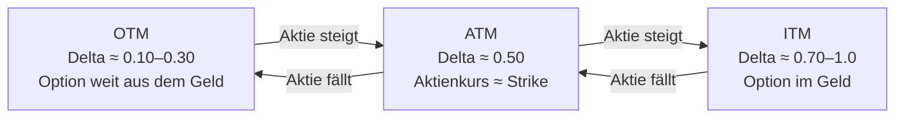
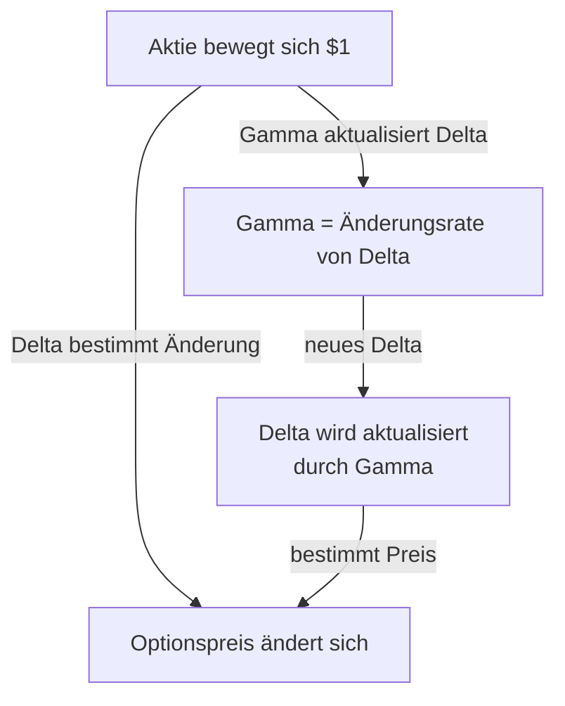
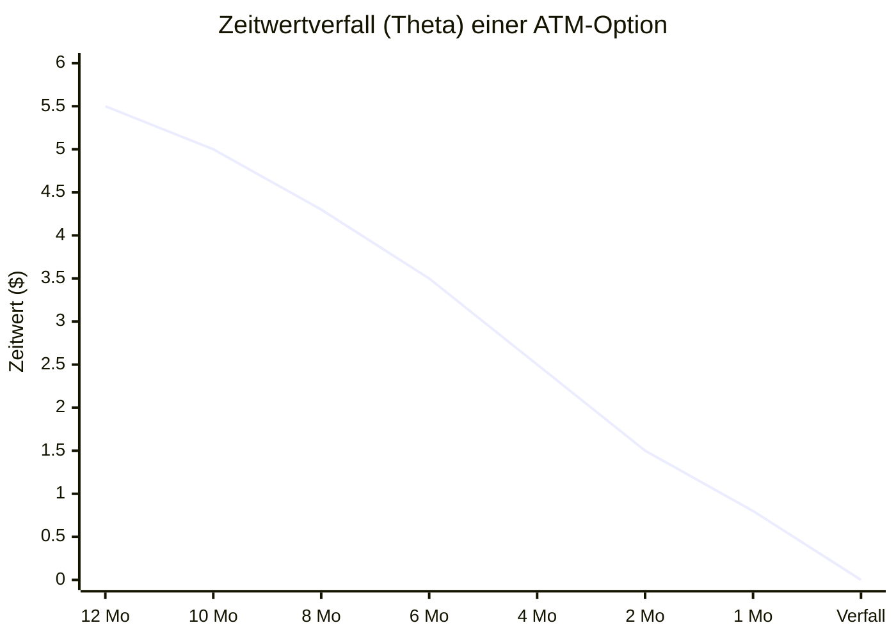
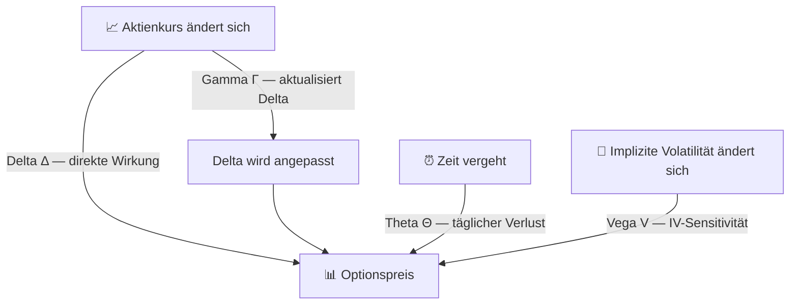

# Anki-Karten: Die Options-Greeks (Anfängerkurs)

**Deck:** `Optionen::Griechen`  
**Sprache:** Deutsch | **Niveau:** Anfänger  
**Karten gesamt:** 19 (15 Basic + 4 Cloze)  
**Erstellt:** 2026-07-06

---

## Empfohlene Deck-Struktur

```
Optionen::Griechen::Delta
Optionen::Griechen::Gamma
Optionen::Griechen::Theta
Optionen::Griechen::Vega
Optionen::Griechen::Übersicht
```

---

## Hinweis: Diagramm-Karten in Anki

Für die Karten mit Mermaid-Diagrammen füge einmalig folgenden Code in die Anki-Kartenvorlage ein (Card Template → Rückseite, oben):

```html
<script src="https://cdn.jsdelivr.net/npm/mermaid/dist/mermaid.min.js"></script>
<script>mermaid.initialize({startOnLoad:true});</script>
```

---

## Delta-Karten (5 Karten)

---

### Karte D1 — Basic `Optionen::Griechen::Delta`

**Vorderseite:**
> Du hältst eine Call-Option mit **Delta = 0.40**.  
> Die Aktie steigt um **$1**.  
> Um wie viel ändert sich der Optionspreis näherungsweise?

**Rückseite:**

Der Optionspreis steigt um ca. **$0.40** (= 0.40 × $1).

Delta misst die **Preisänderung der Option** pro $1 Kursänderung der Aktie.

🧠 **Eselsbrücke:** Delta = „wie viele Cent bewegt sich die Option, wenn die Aktie $1 bewegt?"

---

### Karte D2 — Basic `Optionen::Griechen::Delta`

**Vorderseite:**
> In welchem Wertebereich liegt Delta für Call- und Put-Optionen?

**Rückseite:**

| Optionstyp | Wertebereich | OTM → ATM → ITM |
|---|---|---|
| Call | 0 bis +1.0 | 0.10 → 0.50 → 0.90 |
| Put | −1.0 bis 0 | −0.10 → −0.50 → −0.90 |

**Merkhilfe:** ATM-Optionen haben immer Delta ≈ **±0.50**

---

### Karte D3 — Basic `Optionen::Griechen::Delta`

**Vorderseite:**
> Was bedeutet es, wenn eine Call-Option **Delta = 0.50** hat?

**Rückseite:**

Die Option ist „at the money" (ATM) — der Aktienkurs liegt ungefähr beim Strike-Preis.

Delta ≈ 0.50 entspricht auch **~50% Wahrscheinlichkeit**, dass die Option bei Verfall im Geld (ITM) endet.

⚠️ Das ist eine Näherung, keine exakte Wahrscheinlichkeit!

---

### Karte D4 — Cloze `Optionen::Griechen::Delta`

Delta misst die **Preisänderung der Option** pro $1 {{c1::Kursänderung der Aktie}}.  
Calls haben immer ein {{c2::positives}} Delta (0 bis 1).  
Puts haben immer ein {{c3::negatives}} Delta (−1 bis 0).  
Eine ATM-Option hat Delta ≈ {{c4::±0.50}}.

---

### Karte D5 — Diagramm `Optionen::Griechen::Delta`

**Vorderseite:**
> Wie verändert sich das Delta einer Call-Option je nach Moneyness (OTM → ATM → ITM)?

**Rückseite:**



Delta **steigt**, je weiter eine Call-Option ins Geld (ITM) rückt.

---

## Gamma-Karten (4 Karten)

---

### Karte G1 — Basic `Optionen::Griechen::Gamma`

**Vorderseite:**
> Du hast eine Call-Option mit **Delta = 0.50** und **Gamma = 0.05**.  
> Die Aktie steigt um **$1**.  
> Was ist das neue Delta nach dieser Bewegung?

**Rückseite:**

Neues Delta = **0.55** (= 0.50 + 0.05)

Gamma misst, wie schnell sich **Delta** bei einer $1 Bewegung der Aktie ändert.

🚗 **Analogie:** Delta = Geschwindigkeit des Optionspreises. Gamma = Beschleunigung.

---

### Karte G2 — Basic `Optionen::Griechen::Gamma`

**Vorderseite:**
> Wann ist das Gamma einer Option am höchsten?

**Rückseite:**

Bei **ATM-Optionen kurz vor dem Verfallsdatum**.

Warum? ATM-Optionen „kippen" am schnellsten zwischen ITM und OTM — kurz vor Verfall ist diese Unsicherheit am größten.

⚠️ **Risiko:** Hohes Gamma = Delta ändert sich schnell = große Überraschungen möglich!

---

### Karte G3 — Cloze `Optionen::Griechen::Gamma`

Gamma misst die {{c1::Änderungsrate von Delta}} pro $1 Bewegung der Aktie.  
Gamma ist am höchsten bei {{c2::ATM-Optionen nahe dem Verfallsdatum}}.  
Als Optionskäufer hast du {{c3::positives}} Gamma (du profitierst von großen Bewegungen).  
Als Optionsverkäufer hast du {{c4::negatives}} Gamma (große Bewegungen schaden dir).

---

### Karte G4 — Diagramm `Optionen::Griechen::Gamma`

**Vorderseite:**
> Wie hängen Delta und Gamma zusammen?

**Rückseite:**



🧠 **Merkhilfe:** Gamma ist das „Update" für Delta nach jeder Kursbewegung.

---

## Theta-Karten (4 Karten)

---

### Karte T1 — Basic `Optionen::Griechen::Theta`

**Vorderseite:**
> Du besitzt eine Call-Option. **Theta = −0.05**.  
> Was passiert mit dem Optionspreis, wenn ein Tag vergeht (ohne Kursbewegung)?

**Rückseite:**

Der Optionspreis sinkt um ca. **$0.05** — einfach weil ein Tag vergangen ist.

Theta misst den **täglichen Zeitwertverlust** einer Option.

| Position | Theta | Bedeutung |
|---|---|---|
| Optionskäufer | Negativ | Verlierst täglich Wert |
| Optionsverkäufer | Positiv | Sammelst täglich Prämie |

---

### Karte T2 — Basic `Optionen::Griechen::Theta`

**Vorderseite:**
> Warum ist es riskant, eine Option mit nur noch **2 Wochen** bis zum Verfall zu **kaufen**?

**Rückseite:**

Weil **Theta (Zeitverfall) nahe dem Verfallsdatum am stärksten wirkt**.

Der Zeitwertverlust beschleunigt sich exponentiell in den letzten Wochen. Eine ATM-Option kann im letzten Monat mehr Wert verlieren als in allen vorherigen Monaten zusammen.

📅 **Faustregel:** Je weniger Zeit bis Verfall, desto aggressiver frisst Theta den Optionswert.

---

### Karte T3 — Cloze `Optionen::Griechen::Theta`

Theta ist fast immer {{c1::negativ}} für den Optionskäufer, weil der Zeitwert {{c2::täglich abnimmt}}.  
Der Zeitverfall beschleunigt sich {{c3::nahe dem Verfallsdatum}}.  
Optionsverkäufer profitieren von {{c4::positivem Theta}} (sie kassieren den Zeitwert).

---

### Karte T4 — Diagramm `Optionen::Griechen::Theta`

**Vorderseite:**
> Wie verläuft der Zeitwert einer ATM-Option über die Zeit bis zum Verfall?

**Rückseite:**



Der Zeitwert **fällt nicht linear** — die Kurve wird zum Verfallsdatum hin steiler (stärkerer Verfall).  
In den letzten 2 Monaten verliert die Option genauso viel wie in den ersten 10 Monaten zusammen!

---

## Vega-Karten (4 Karten)

---

### Karte V1 — Basic `Optionen::Griechen::Vega`

**Vorderseite:**
> Was misst **Vega** bei einer Option?  
> Angenommen: **Vega = 0.10** — was passiert bei IV +1%?

**Rückseite:**

**Vega** misst, wie stark sich der Optionspreis ändert, wenn die **implizite Volatilität (IV)** um 1% steigt oder fällt.

Beispiel mit Vega = 0.10:
- IV steigt +1% → Optionspreis **+$0.10**
- IV fällt −1% → Optionspreis **−$0.10**

---

### Karte V2 — Basic `Optionen::Griechen::Vega`

**Vorderseite:**
> Du kaufst eine Call-Option (Long).  
> Die Marktvolatilität (IV) steigt plötzlich stark an.  
> Was passiert mit dem Wert deiner Option?

**Rückseite:**

Der Optionswert **steigt** — du bist „Long Vega".

| Position | Vega | Profitiert von |
|---|---|---|
| Optionskäufer | Positiv (Long Vega) | Steigender IV |
| Optionsverkäufer | Negativ (Short Vega) | Fallender IV |

💡 **Merkhilfe:** Hohe IV = mehr Chance auf große Bewegungen = Optionen wertvoller → Käufer profitiert.

---

### Karte V3 — Basic `Optionen::Griechen::Vega`

**Vorderseite:**
> Bei welchen Optionen ist Vega am höchsten?

**Rückseite:**

Bei **ATM-Optionen mit langer Restlaufzeit** (z.B. LEAPs mit 6–12 Monaten).

Warum?
- **ATM:** Maximale Unsicherheit → IV hat größten Einfluss
- **Lange Laufzeit:** Mehr Zeit für Volatilitätsänderungen → stärkere Auswirkung

📌 **Praktisch:** Ein LEAP bei +5% IV kann deutlich im Preis steigen, ohne dass sich die Aktie bewegt.

---

### Karte V4 — Cloze `Optionen::Griechen::Vega`

Vega misst die Sensitivität des Optionspreises gegenüber {{c1::impliziter Volatilität (IV)}}.  
Wenn IV steigt, profitieren {{c2::Optionskäufer (Long Vega)}}.  
Wenn IV fällt, profitieren {{c3::Optionsverkäufer (Short Vega)}}.  
Vega ist am höchsten bei {{c4::ATM-Optionen mit langer Restlaufzeit}}.

---

## Übersicht-Karten (2 Karten)

---

### Karte Ü1 — Basic `Optionen::Griechen::Übersicht`

**Vorderseite:**
> Nenne die vier wichtigsten Options-Greeks und was sie jeweils messen.

**Rückseite:**

| Greek | Symbol | Misst… | Beeinflusst durch |
|---|---|---|---|
| Delta | Δ | Preisänderung pro $1 Aktienbewegung | Aktienkurs |
| Gamma | Γ | Änderungsrate von Delta | Aktienkurs |
| Theta | Θ | Täglicher Zeitwertverlust | Zeit |
| Vega | V | Sensitivität ggü. Volatilität (IV) | Implizite Volatilität |

🧠 **Eselsbrücke:** **D**ein **G**ewinn **T**räumt **V**on (Delta, Gamma, Theta, Vega)

---

### Karte Ü2 — Diagramm `Optionen::Griechen::Übersicht`

**Vorderseite:**
> Welche Marktfaktoren beeinflussen den Optionspreis — und welcher Greek misst den jeweiligen Einfluss?

**Rückseite:**



Die vier Greeks messen jeweils den Einfluss eines anderen Marktfaktors auf den Optionspreis.
