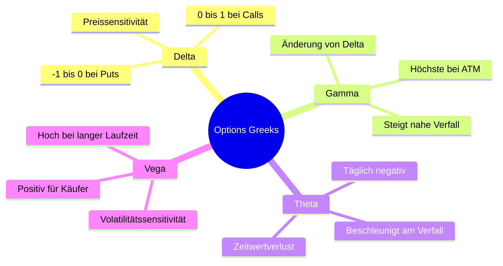
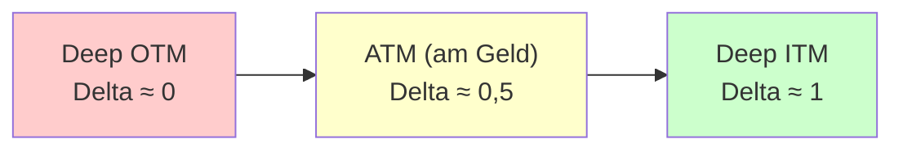
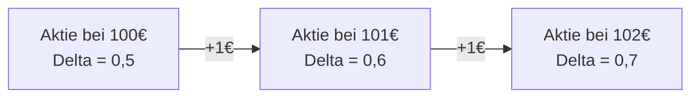
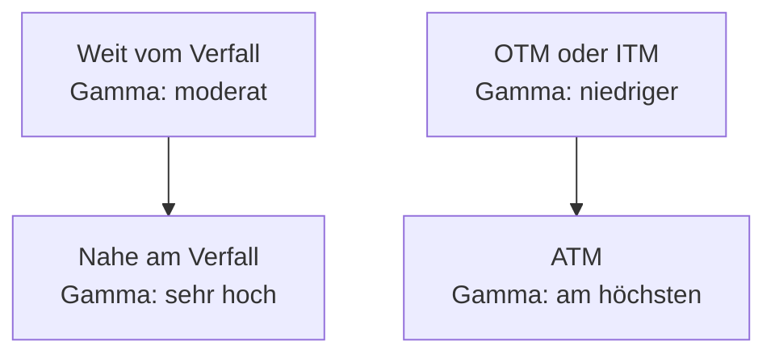
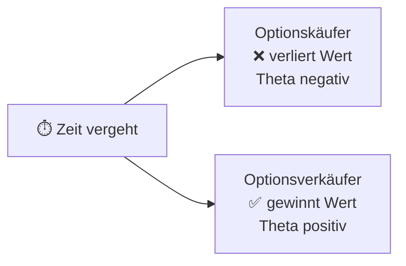
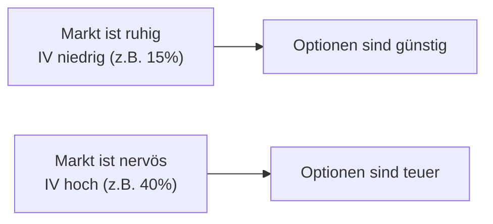

# Anki-Karten: Options Greeks auf Deutsch (Anfänger)

> **Lernziel:** Delta, Gamma, Theta und Vega verstehen — mit Beispielen und Diagrammen.

---

## Übersicht: Die vier wichtigsten Greeks



---

## DELTA (Δ)

---

### Karte D-1
**Vorderseite:** Was ist Delta bei einer Option?

**Rückseite:**

Delta misst, wie stark sich der **Preis einer Option ändert**, wenn sich der Kurs des Basiswerts um **1 € (oder 1 Einheit)** bewegt.

| Option | Delta-Bereich |
|--------|--------------|
| Call (Kaufoption) | 0 bis +1 |
| Put (Verkaufsoption) | −1 bis 0 |

**Merksatz:** Delta ist wie das "Gaspedal" der Option — es zeigt, wie sensibel die Option auf Kursbewegungen reagiert.

---

### Karte D-2
**Vorderseite:** Eine Call-Option hat Delta = 0,6. Die Aktie steigt um 2 €. Wie ändert sich der Optionspreis (näherungsweise)?

**Rückseite:**

**Formel:** Preisänderung ≈ Delta × Kursänderung

$$\Delta P \approx \delta \times \Delta S = 0{,}6 \times 2\,€ = 1{,}20\,€$$

Der Call-Preis steigt um **~1,20 €**.

> Fällt die Aktie um 2 €, fällt der Call um ~1,20 €.

---

### Karte D-3
**Vorderseite:** Welche Delta-Werte haben ITM-, ATM- und OTM-Optionen?

**Rückseite:**



| Lage | Call-Delta | Beschreibung |
|------|-----------|-------------|
| Deep OTM | ≈ 0,05–0,20 | Kaum Reaktion auf Kursbewegungen |
| ATM | ≈ 0,50 | Mittlere Reaktion |
| Deep ITM | ≈ 0,80–1,00 | Verhält sich fast wie die Aktie selbst |

> Für Puts: gleiches Muster, aber mit negativem Vorzeichen (−1 bis 0).

---

### Karte D-4
**Vorderseite:** Was sagt Delta über die Wahrscheinlichkeit des Verfalls im Geld (In-the-Money)?

**Rückseite:**

Delta kann als **grobe Wahrscheinlichkeit** interpretiert werden, dass eine Option am Verfallstag im Geld liegt:

- Delta 0,70 → ~70 % Wahrscheinlichkeit ITM
- Delta 0,50 → ~50 % (typisch für ATM-Optionen)
- Delta 0,20 → ~20 % Wahrscheinlichkeit ITM

> **Beispiel:** Du kaufst einen OTM-Call mit Delta 0,25. Das bedeutet: nur ~25 % Chance, dass er am Ende etwas wert ist — dafür ist er billiger!

---

## GAMMA (Γ)

---

### Karte G-1
**Vorderseite:** Was ist Gamma bei einer Option?

**Rückseite:**

Gamma misst, **wie schnell sich Delta ändert**, wenn sich der Kurs des Basiswerts um 1 € bewegt.

$$\text{Gamma} = \frac{\Delta \text{(neues Delta)} - \Delta \text{(altes Delta)}}{\text{Kursänderung}}$$

**Einfach gesagt:** Gamma ist das "Delta des Deltas" — die Beschleunigung der Option.

- Gamma ist **immer positiv** für Käufer (Long-Positionen)
- Gamma ist **immer negativ** für Verkäufer (Short-Positionen)

---

### Karte G-2
**Vorderseite:** Eine Call-Option hat Delta = 0,5 und Gamma = 0,1. Die Aktie steigt um 1 €. Was ist das neue Delta?

**Rückseite:**

**Formel:** Neues Delta = Altes Delta + Gamma × Kursänderung

$$\delta_{\text{neu}} = 0{,}5 + 0{,}1 \times 1 = 0{,}6$$

Nach einem **weiteren €1-Anstieg:**
$$\delta_{\text{neu}} = 0{,}6 + 0{,}1 \times 1 = 0{,}7$$



Gamma sorgt dafür, dass Long-Optionskäufer **überproportional** von starken Kursbewegungen profitieren!

---

### Karte G-3
**Vorderseite:** Wann ist Gamma am größten?

**Rückseite:**

Gamma ist **am höchsten** bei:
1. **ATM-Optionen** (am Geld)
2. **Kurz vor dem Verfallstag**

**Warum?** Weil kleine Kursbewegungen dann entscheidend sind — ob die Option im Geld verfällt oder nicht.



> **Für Käufer:** Hohes Gamma = Chance auf schnelle Gewinne bei starken Bewegungen  
> **Für Verkäufer:** Hohes Gamma = hohes Risiko bei großen Kursbewegungen

---

## THETA (Θ)

---

### Karte T-1
**Vorderseite:** Was ist Theta bei einer Option?

**Rückseite:**

Theta misst den **täglichen Wertverlust einer Option** durch den bloßen Ablauf der Zeit — auch **Zeitwertverlust** oder auf Englisch "time decay" genannt.

- Theta ist für **Käufer** (Long) fast immer **negativ**
- Theta ist für **Verkäufer** (Short) fast immer **positiv**

**Beispiel:** Theta = −0,05  
→ Die Option verliert jeden Tag ~**0,05 €** an Wert, selbst wenn sich der Kurs nicht bewegt.

---

### Karte T-2
**Vorderseite:** Wer profitiert von Theta — Käufer oder Verkäufer der Option?

**Rückseite:**



**Merksatz:** Optionsverkäufer sind wie Versicherungen — sie kassieren Prämien und hoffen, dass "nichts passiert" (kein großer Kursbewegung).

**Zeitarbeitet...**
- **gegen** den Käufer (Long)
- **für** den Verkäufer (Short)

---

### Karte T-3
**Vorderseite:** Wie verändert sich die Theta-Kurve (Zeitwertverlust) im Laufe der Optionslaufzeit?

**Rückseite:**

Der Zeitwertverlust **beschleunigt sich exponentiell** je näher der Verfallstag rückt:

```
Zeitwert
   |
   |████
   |    ████
   |        ████
   |            ████████████
   +---------------------------------> Zeit bis Verfall
 Verfall   30T    60T    90T    180T
```

**Faustregel:** In den **letzten 30 Tagen** vor Verfall fällt der Zeitwert einer ATM-Option besonders schnell.

> Ein Optionskäufer sollte sich dieser Kurve bewusst sein — je länger man wartet, desto mehr kostet der Zeitverlauf!

---

### Karte T-4
**Vorderseite:** Welche Strategien nutzen Theta (Zeitwertverlust) bewusst aus?

**Rückseite:**

**Theta-positive Strategien (Verkäuferstrategien):**
- **Covered Call:** Aktie halten, Call verkaufen → kassiert Prämie täglich
- **Cash-Secured Put:** Put verkaufen → kassiert Prämie täglich
- **Iron Condor:** Mehrere Optionen verkaufen → maximiert Theta-Einnahmen

**Theta-negative Strategien (Käuferstrategien):**
- **Long Call / Long Put:** Muss darauf achten, dass die Kursrichtung schnell eintrifft

> **Merksatz:** "Theta sammeln" = Optionen verkaufen und Zeit für sich arbeiten lassen.

---

## VEGA (ν)

---

### Karte V-1
**Vorderseite:** Was ist Vega bei einer Option?

**Rückseite:**

Vega misst, wie stark sich der **Optionspreis ändert**, wenn sich die **implizite Volatilität (IV)** um **1 Prozentpunkt** ändert.

- Vega ist für Käufer **positiv** (mehr Volatilität = teurer)
- Vega ist für Verkäufer **negativ** (mehr Volatilität = schlechter)

**Beispiel:** Vega = 0,20  
→ Steigt die IV um 1 %, steigt der Optionspreis um ~**0,20 €**

---

### Karte V-2
**Vorderseite:** Was ist "implizite Volatilität" (IV) und warum ist sie für Optionen wichtig?

**Rückseite:**

**Implizite Volatilität (IV)** ist die Markterwartung über die **zukünftige Schwankungsbreite** des Basiswerts — ausgedrückt als Prozentzahl.



> **Merksatz:** Wer billig kauft und teuer verkauft, muss auf die IV achten — nicht nur auf die Kursrichtung!

---

### Karte V-3
**Vorderseite:** Eine Option hat Vega = 0,25. Die implizite Volatilität steigt von 20% auf 23%. Wie ändert sich der Optionspreis?

**Rückseite:**

**Formel:** Preisänderung ≈ Vega × Änderung der IV

$$\Delta P \approx 0{,}25 \times 3 = 0{,}75\,€$$

Der Optionspreis steigt um **~0,75 €**.

> Sinkt die IV um 3%, fällt der Optionspreis um ~0,75 € — auch wenn sich der Aktienkurs gar nicht bewegt hat! Dieses Phänomen heißt **"Vega-Crush"** (z.B. nach Earnings).

---

### Karte V-4
**Vorderseite:** Bei welchen Optionen ist Vega besonders hoch oder niedrig?

**Rückseite:**

**Vega ist hoch bei:**
| Eigenschaft | Warum? |
|-------------|--------|
| Langer Restlaufzeit (LEAPS, 6–12 Monate) | Mehr Zeit = mehr Einfluss der Volatilität |
| ATM-Optionen | Maximale Unsicherheit über den Ausgang |

**Vega ist niedrig bei:**
- Sehr kurz laufenden Optionen (wenige Tage)
- Deep ITM oder Deep OTM Optionen

> **Praxistipp:** Wer Optionen kurz vor einem großen Ereignis (z.B. Quartalszahlen) kauft, zahlt einen hohen IV-Aufschlag. Nach dem Ereignis fällt die IV oft schlagartig → der Optionspreis sinkt, **obwohl** die Aktie sich in die richtige Richtung bewegt hat!

---

## Zusammenfassung: Greeks auf einen Blick

| Greek | Misst | Positiv für Käufer? | Schlüsselwort |
|-------|-------|---------------------|---------------|
| **Δ Delta** | Preisänderung bei Kursbewegung | Ja (Call) / Nein (Put) | Preissensitivität |
| **Γ Gamma** | Änderung von Delta | Ja | Krümmung / Beschleunigung |
| **Θ Theta** | Täglicher Zeitwertverlust | Nein | Zeit = Feind des Käufers |
| **ν Vega** | Änderung durch Volatilitätsänderung | Ja | Volatilitätssensitivität |

---

*Erstellt für Anfänger im Optionshandel — Deutsch*
