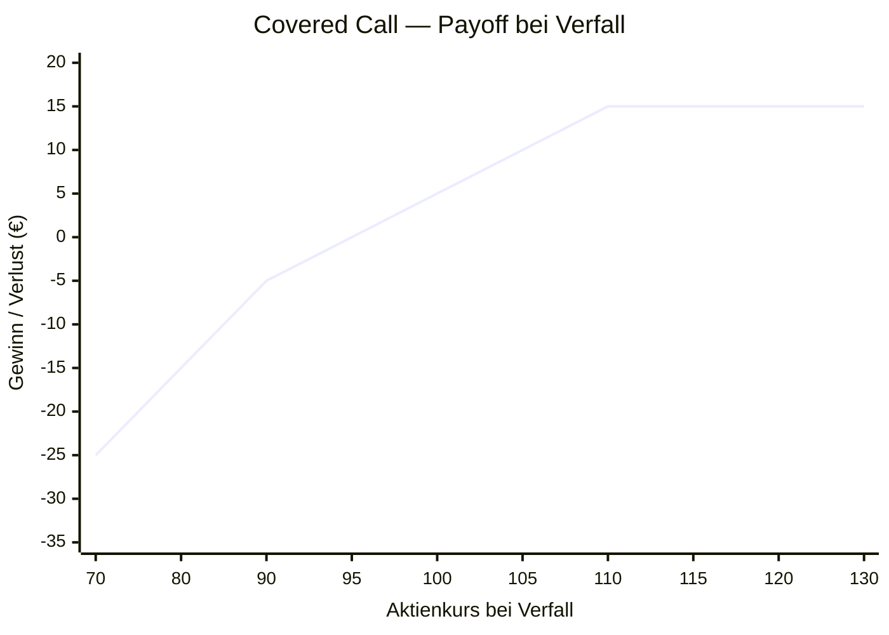

# Anki-Karten: Covered Call Strategie

---

## Karte 1 — Definition

**Q: Was ist ein Covered Call?**

Ein Covered Call kombiniert zwei Positionen:

1. **Long Stock** — du besitzt 100 Aktien (zu Preis S₀)
2. **Short Call** — du verkaufst eine Call-Option auf dieselbe Aktie (Strike K, Prämie C)

"Covered" = Der Call ist durch den tatsächlichen Aktienbesitz gedeckt — kein Naked-Risiko.

---

## Karte 2 — Wann einsetzen?

**Q: Wann setzt du einen Covered Call ein?**

Nutze einen Covered Call wenn:

- Du **neutral bis leicht bullisch** auf eine Aktie bist
- Du **Einkommen** (Prämie) aus deiner bestehenden Position generieren willst
- Du bereit bist, das **Aufwärtspotenzial bei Strike K zu deckeln**
- Die **implizite Volatilität (IV) relativ hoch** ist (mehr Prämie)
- Du nicht von einer starken Aufwärtsbewegung erwartest

**Nicht geeignet wenn:** Du stark bullisch bist oder eine große Aufwärtsbewegung erwartest.

---

## Karte 3 — Setup

**Q: Wie setzt du einen Covered Call auf?**

| Komponente | Aktion | Cashflow |
|---|---|---|
| Aktie | Kaufen / bereits halten (100 Stück) | −S₀ |
| Call Option | Verkaufen (Strike K, Laufzeit T) | +C |
| **Netto-Kostenbasis** | | **S₀ − C** |

Beispiel: Aktie bei 100 €, Verkauf Call mit Strike 110 €, Prämie 5 €  
→ Effektiver Einstandspreis: 100 − 5 = **95 €**

---

## Karte 4 — Maximaler Gewinn

**Q: Was ist der maximale Gewinn eines Covered Calls?**

$$\text{Max Gewinn} = (K - S_0) + C$$

**Wann?** Wenn der Aktienkurs bei Verfall $S_T \geq K$ ist — die Aktie wird zum Strike-Preis K „weggerufen" (Call wird ausgeübt).

**Beispiel:** S₀ = 100, K = 110, C = 5  
→ Max Gewinn = (110 − 100) + 5 = **15 €** pro Aktie

Der Gewinn ist **gedeckelt** — egal wie hoch die Aktie steigt.

---

## Karte 5 — Maximaler Verlust

**Q: Was ist der maximale Verlust eines Covered Calls?**

$$\text{Max Verlust} = S_0 - C$$

**Wann?** Wenn die Aktie auf **null** fällt. Die erhaltene Prämie reduziert den Verlust.

**Beispiel:** S₀ = 100, C = 5  
→ Max Verlust = 100 − 5 = **95 €** pro Aktie

> Hinweis: Dies ist besser als reiner Aktienbesitz (Verlust = 100 €), aber die Prämie schützt nur begrenzt.

---

## Karte 6 — Breakeven

**Q: Was ist der Breakeven-Punkt eines Covered Calls?**

$$\text{Breakeven} = S_0 - C$$

**Beispiel:** S₀ = 100, C = 5 → Breakeven = **95 €**

Die Prämie senkt die effektive Kostenbasis. Liegt der Kurs bei Verfall über 95 €, machst du Gewinn.

---

## Karte 7 — Payoff-Diagramm

**Q: Wie sieht das Payoff-Diagramm eines Covered Calls aus?**

*(Beispiel: S₀ = 100, K = 110, C = 5)*



**ASCII-Version:**

```
  P&L
   15 |                        ___________
      |                       /
   10 |                      /
      |                     /
    5 |....................../   ← Prämie
      |                   /
    0 +--+---+---+-------+----+--------> Aktienkurs
      |  70  80  90     95  100  110  120
   -5 |                 ^    ^    ^
      |                 BE  S₀    K
  -25 |    ← Kursverlust, gemildert durch Prämie
      |
```

| Zone | Kurs bei Verfall | P&L |
|---|---|---|
| Verlustzone | S_T < 95 | (S_T − 100) + 5 < 0 |
| Breakeven | S_T = 95 | 0 |
| Gewinnzone | 95 < S_T < 110 | (S_T − 100) + 5 |
| Max Gewinn | S_T ≥ 110 | **15 € (gedeckelt)** |

---

## Karte 8 — Greeks

**Q: Welche Greeks sind beim Covered Call relevant?**

| Greek | Wert | Bedeutung |
|---|---|---|
| **Delta** | 0 bis +1 | Kleiner als bei reinem Aktienbesitz (1 − Δ_Call) |
| **Theta** | **Positiv** | Zeitwertverlust des verkauften Calls kommt dir zugute |
| **Vega** | **Negativ** | Fallende IV erhöht den Gewinn (Short Vega) |
| **Gamma** | Negativ | Negative Gamma durch Short Call |

> Theta ist dein Freund: Mit jeder verstrichenen Nacht verliert der Call an Wert — das ist dein Gewinn.

---

## Karte 9 — Vergleich: Covered Call vs. reiner Aktienbesitz

**Q: Was sind die Unterschiede zwischen Covered Call und reinem Aktienbesitz?**

| Merkmal | Reiner Aktienbesitz | Covered Call |
|---|---|---|
| Max Gewinn | Unbegrenzt | Gedeckelt bei (K − S₀) + C |
| Max Verlust | S₀ (Totalverlust) | S₀ − C (Prämie reduziert) |
| Breakeven | S₀ | S₀ − C |
| Einkommen | Keins | Prämie C |
| Beste Marktlage | Stark steigend | Seitwärts / leicht steigend |

---

## Karte 10 — Rolling (Verlängerung)

**Q: Was bedeutet "Rolling" beim Covered Call?**

**Rolling** = Den bestehenden Call zurückkaufen und einen neuen verkaufen.

| Variante | Bedeutung | Wann? |
|---|---|---|
| **Roll out** | Gleicher Strike, späteres Verfallsdatum | Mehr Zeit kaufen, Assignment vermeiden |
| **Roll up** | Höherer Strike, gleiches oder späteres Datum | Aktie ist gestiegen, mehr Upside sichern |
| **Roll down** | Niedrigerer Strike | Mehr Prämie einsammeln (erhöht Verlustrisiko) |

> Ziel: Assignment (Zwangsverkauf der Aktie) verzögern oder Prämieneinnahmen optimieren.
