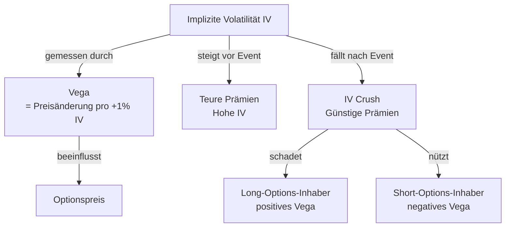

# Anki-Karten: Implizite Volatilität, IV Crush & Vega

## Deck-Struktur
```
Optionen::Volatilität::Implizite Volatilität
Optionen::Volatilität::IV Crush
Optionen::Griechen::Vega
```

---

## Karte 1 — Basic (Optionen::Volatilität::Implizite Volatilität)

**Vorderseite:**
Was spiegelt die **Implizite Volatilität (IV)** einer Option wider?

**Rückseite:**
Die **Markterwartung zukünftiger Kursschwankungen** des Basiswerts.

Wichtig: IV ist zukunftsgerichtet — sie zeigt, welche Bewegung der Markt *erwartet*, nicht was historisch passiert ist.

Eselsbrücke: „Implizit" = der Markt hat diese Erwartung *implizit* in den Preis eingepreist.

---

## Karte 2 — Basic (Optionen::Volatilität::Implizite Volatilität)

**Vorderseite:**
Die IV einer Aktie steigt stark an. Was passiert mit den Optionsprämien — und warum?

**Rückseite:**
Die Prämien werden **teurer**.

Grund: Höhere IV = Markt erwartet größere Kursbewegungen = größeres Risiko für Optionsverkäufer → Verkäufer verlangen mehr Prämie.

Merke: **Hohe IV = teure Prämien** (gut für Verkäufer), **niedrige IV = günstige Prämien** (gut für Käufer).

---

## Karte 3 — Basic (Optionen::Volatilität::IV Crush)

**Vorderseite:**
Was bedeutet **IV Crush** und nach welchem Ereignistyp tritt er typischerweise auf?

**Rückseite:**
Nach wichtigen Ereignissen (z.B. **Earnings**, Notenbank-Entscheidungen) fällt die IV **schlagartig** — dieser plötzliche Rückgang heißt IV Crush.

Grund: Vor dem Event ist die Unsicherheit hoch → IV steigt. Nach dem Event ist die Unsicherheit aufgelöst → IV fällt.

---

## Karte 4 — Basic (Optionen::Volatilität::IV Crush)

**Vorderseite:**
Du kaufst eine Call-Option vor einem Earnings-Report. Die Aktie steigt wie erwartet um 3% — dennoch verlierst du Geld mit der Option. Was ist die wahrscheinlichste Ursache?

**Rückseite:**
**IV Crush** — nach dem Earnings-Report ist die implizite Volatilität stark gefallen.

Der Kursgewinn (positives Delta) wurde durch den Prämienverfall durch sinkende IV (negativer Vega-Effekt) überkompensiert.

Merke: Long Optionen haben **positives Vega** → IV Crush schadet Long-Inhabern direkt.

---

## Karte 5 — Basic (Optionen::Griechen::Vega)

**Vorderseite:**
Was misst **Vega** bei Optionen?

**Rückseite:**
Vega misst, wie stark sich der **Optionspreis** bei einer IV-Änderung von **+1%** verändert.

Beispiel: Vega = 0.15 → Steigt IV um 1%, steigt der Optionspreis um ca. $0.15 (ceteris paribus).

Merke: Long Optionen = positives Vega (profitieren von steigender IV), Short Optionen = negatives Vega.

---

## Karte 6 — Cloze (Optionen::Volatilität::Implizite Volatilität)

**Text:**
Die {{c1::Implizite Volatilität (IV)}} spiegelt die Markterwartung zukünftiger Kursschwankungen wider. Hohe IV bedeutet {{c2::teure}} Optionsprämien, niedrige IV bedeutet {{c2::günstige}} Prämien. Nach Earnings fällt die IV schlagartig — dieser Effekt heißt {{c3::IV Crush}} und schadet besonders {{c4::Long-Options-Inhabern}}.

**Zusatzmaterial:**
Vega misst die Preisänderung der Option bei +1% IV-Änderung.

---

## Karte 7 — Diagramm-Karte (Optionen::Griechen::Vega)

**Vorderseite:**
Wie hängen Implizite Volatilität (IV), Vega und Optionspreis zusammen?

**Rückseite:**



Merke: **IV ↑ → Optionspreis ↑** (für Long-Inhaber gut). **IV ↓ (IV Crush) → Optionspreis ↓** (für Long-Inhaber schlecht).
