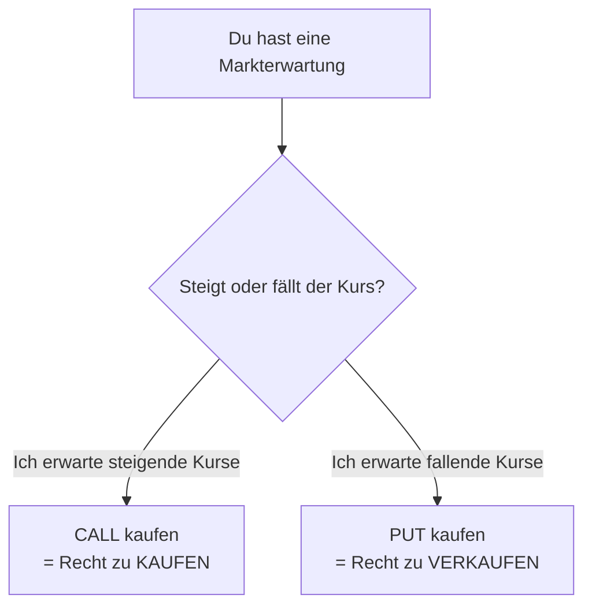
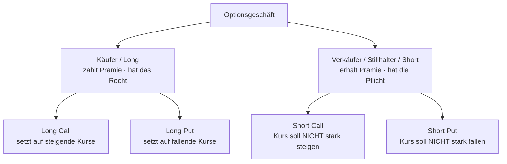
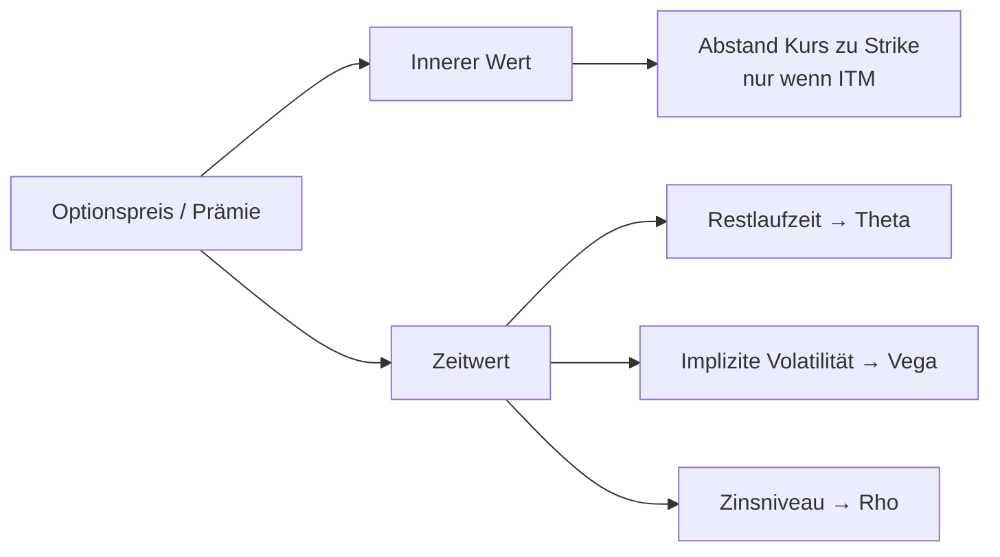
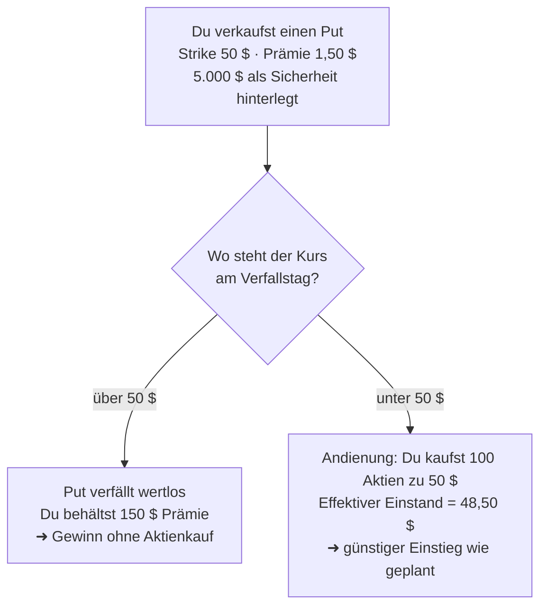
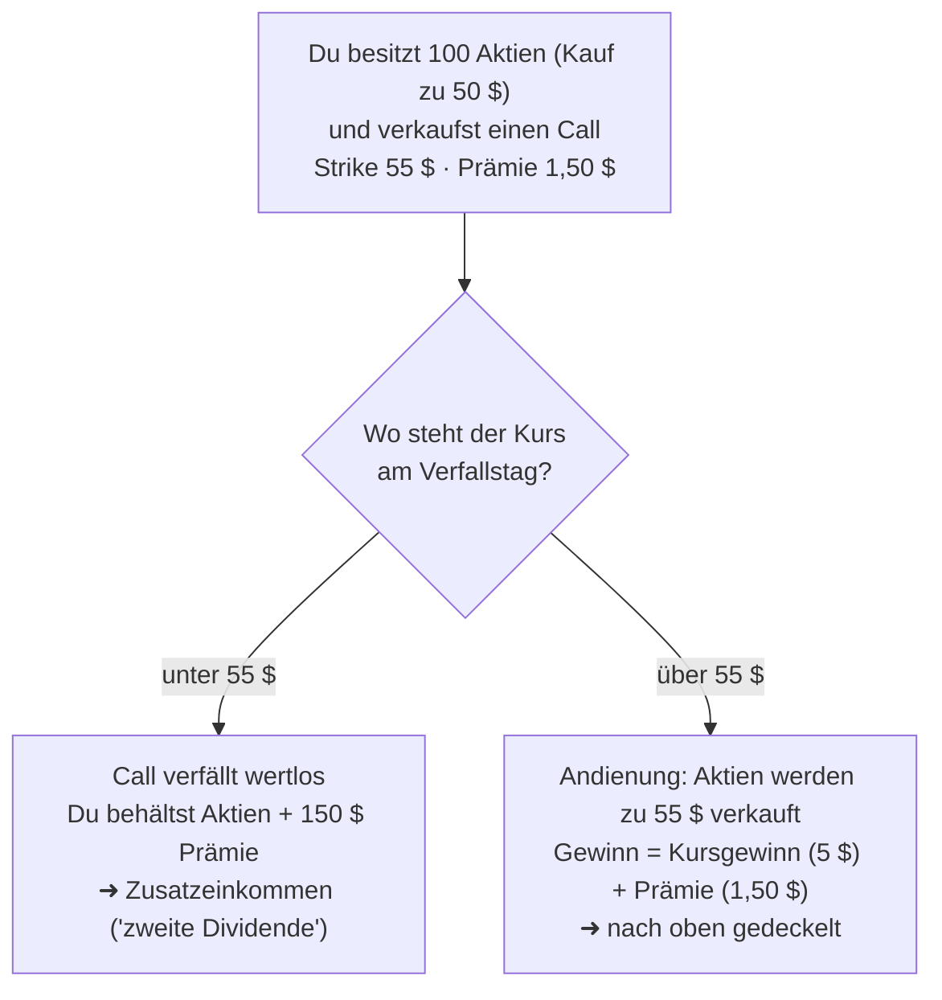
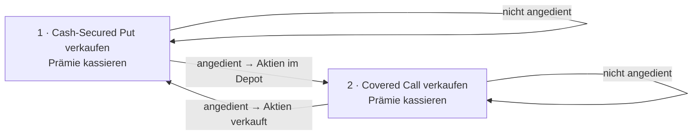
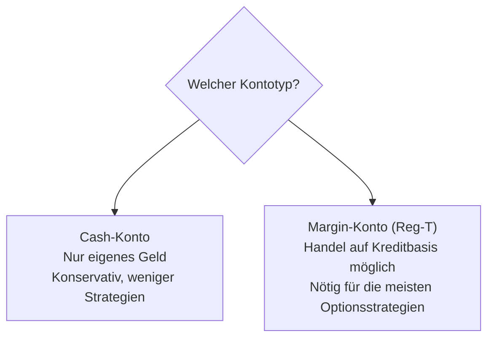
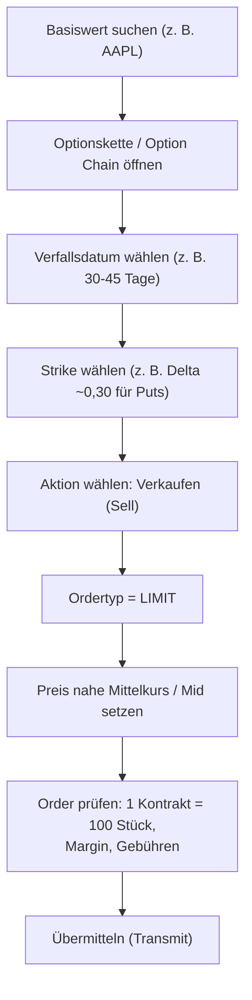
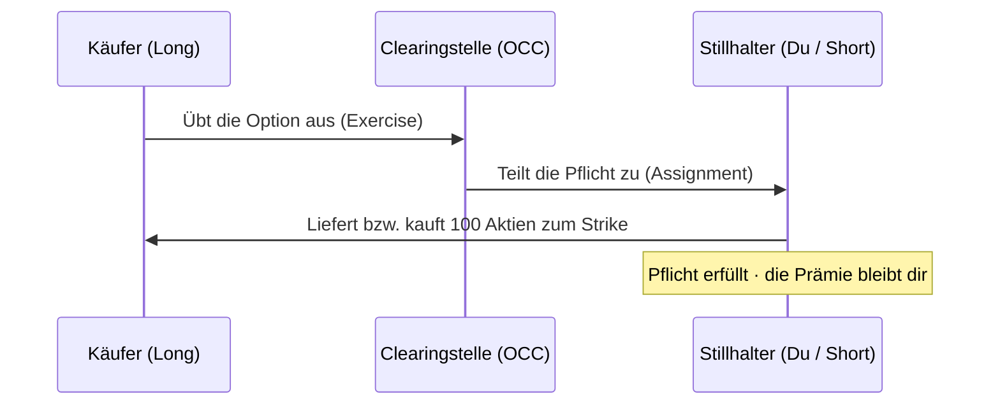
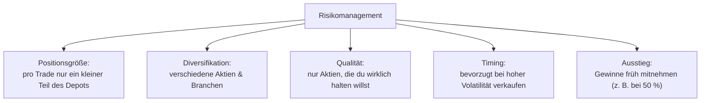

# Optionshandel bei Interactive Brokers – einfach erklärt

> Eine verständliche Zusammenfassung rund um das Thema **Optionen handeln bei Interactive Brokers (IBKR)**.
> Geschrieben in einfacher Sprache für Einsteiger. Kein Vorwissen nötig.

---

## Über dieses Dokument

Dieses Dokument fasst die wichtigsten Inhalte aus den folgenden Quellen zusammen und stellt sie in einen roten Faden – immer mit Blick auf die praktische Umsetzung beim Broker **Interactive Brokers**:

- **YouTube-Kanal „Optionshandel"** – deutschsprachige Videos rund um den Optionshandel.
- **Eichhorn Coaching – „Optionen handeln lernen | Die wichtigsten Grundlagen (Put, Call, Beispiele) Teil 1"** – Grundlagenvideo zu Calls und Puts.
- **Dr. Peter Putz – „Strategisch Investieren mit Aktienoptionen: Konservativer Vermögenszuwachs mit Stillhaltergeschäften"** – Standardwerk zum konservativen Optionsverkauf (Stillhalter).

Alle drei Quellen haben einen gemeinsamen Kern: Sie zeigen, wie man mit dem **Verkauf von Optionen** (sogenannten *Stillhaltergeschäften*) ruhig und regelmäßig Einkommen erzielt – statt zu „zocken". Genau darauf liegt der Schwerpunkt dieses Dokuments.

> ⚠️ **Wichtiger Hinweis:** Dies ist eine Bildungs-Zusammenfassung, **keine Anlageberatung**. Optionen sind Finanzinstrumente mit echten Verlustrisiken. Handle nur mit Geld, dessen Verlust du verkraften kannst, und übe zuerst auf einem Demokonto (Paper Trading).

---

## In 30 Sekunden: Worum geht es?

- Eine **Option** ist ein Vertrag über eine Aktie (oder einen anderen Basiswert).
- Der **Käufer** einer Option zahlt eine **Prämie** und bekommt dafür ein **Recht**.
- Der **Verkäufer** (= **Stillhalter**) kassiert diese Prämie und übernimmt dafür eine **Pflicht**.
- Die konservative Kern-Idee der Quellen: **Optionen verkaufen** und die Prämie als „zweite Dividende" einsammeln.
- Die zwei Einsteiger-Strategien dafür heißen **Cash-Secured Put** und **Covered Call**.
- **Interactive Brokers** ist einer der beliebtesten Broker dafür, weil er günstig ist und weltweit Zugang zu Optionsmärkten bietet.

---

## Teil 1 – Die Grundlagen

### Was ist eine Option?

Eine Option ist ein **Vertrag über den zukünftigen Kauf oder Verkauf** eines Basiswerts. Sie gibt dem Käufer das **Recht** (nicht die Pflicht), eine Aktie zu einem vorher festgelegten Preis zu kaufen oder zu verkaufen.

Es gibt genau zwei Grundtypen:

| Typ | Gibt dem Käufer das Recht … | Der Käufer erwartet … |
|-----|------------------------------|------------------------|
| **Call** (Kaufoption) | … die Aktie zu **kaufen** | … **steigende** Kurse |
| **Put** (Verkaufsoption) | … die Aktie zu **verkaufen** | … **fallende** Kurse |

**Zwei einfache Bilder zum Merken:**

- **Call = Reservierung.** Du sicherst dir heute das Recht, etwas später zu einem festen Preis zu kaufen – egal, wie teuer es dann wirklich ist.
- **Put = Versicherung.** Du sicherst dir das Recht, etwas später zu einem festen Preis zu verkaufen – wie eine Versicherung gegen fallende Kurse.

### Wichtig: Optionen sind keine Optionsscheine!

Ein häufiges Missverständnis in Deutschland. Merke:

- **Optionen** werden **direkt an einer Terminbörse** gehandelt (Käufer und Verkäufer treffen sich am Markt). Preise und Bedingungen sind transparent, es gibt **kein Emittenten-Ausfallrisiko**.
- **Optionsscheine** und **Zertifikate** kaufst du dagegen von einer **Bank (Emittent)**. Geht die Bank pleite, ist dein Geld in Gefahr.
- **Binäre Optionen** sind reine Wetten und haben mit echtem Optionshandel **nichts** zu tun.

Dieses Dokument behandelt ausschließlich **echte Optionen**.

### Die wichtigsten Begriffe

| Begriff | Bedeutung |
|---------|-----------|
| **Basiswert** (Underlying) | Die Aktie/der Wert, auf den sich die Option bezieht (z. B. Apple). |
| **Strike** (Ausübungspreis) | Der vereinbarte Preis, zu dem gekauft/verkauft werden darf. |
| **Prämie** | Der Preis der Option selbst. Der Käufer zahlt sie, der Verkäufer erhält sie. |
| **Laufzeit / Verfall** (Expiration) | Das Datum, an dem die Option ausläuft. |
| **Kontrakt** | 1 Optionskontrakt = **100 Aktien**. Der Multiplikator ist also 100. |
| **Ausübung** (Exercise) | Der Käufer nutzt sein Recht. |
| **Andienung** (Assignment) | Dem Verkäufer wird die Pflicht zugeteilt (er muss liefern/abnehmen). |

> 💡 **Der 100er-Faktor:** Eine Prämie von „1,50 $" bedeutet in Wirklichkeit **1,50 $ × 100 = 150 $** pro Kontrakt. Ein Strike von „50 $" bedeutet bei Andienung **50 $ × 100 = 5.000 $** für das Aktienpaket. Diesen Faktor 100 immer mitdenken!

### Im Geld, am Geld, aus dem Geld (ITM / ATM / OTM)

Diese drei Begriffe beschreiben das Verhältnis von **Kurs** zu **Strike**:

| Kürzel | Name | Call | Put |
|--------|------|------|-----|
| **ITM** | Im Geld (*In The Money*) | Kurs **über** Strike | Kurs **unter** Strike |
| **ATM** | Am Geld (*At The Money*) | Kurs ≈ Strike | Kurs ≈ Strike |
| **OTM** | Aus dem Geld (*Out of The Money*) | Kurs **unter** Strike | Kurs **über** Strike |

Faustregel: **ITM** ist teuer (hat „echten" Wert), **OTM** ist billig (nur Hoffnung auf Bewegung).

---

## Teil 2 – Käufer und Verkäufer: die vier Grundpositionen

Bei jeder Option gibt es zwei Seiten. Das ist der wichtigste Denkschritt im ganzen Optionshandel:

- **Käufer (Long):** zahlt die Prämie, hat ein **Recht**, begrenztes Risiko (maximal die Prämie).
- **Verkäufer / Stillhalter (Short):** erhält die Prämie, hat eine **Pflicht**, und muss ausreichend Kapital oder Aktien bereithalten.

**Warum „Stillhalter"?** Der Verkäufer *hält still* und wartet ab. Er hält entweder die Aktien bereit (bei einem verkauften Call) oder das Geld bereit (bei einem verkauften Put), falls der Käufer sein Recht nutzt. Für dieses Bereithalten und das übernommene Risiko bekommt er die Prämie.

> 📌 **Merksatz aus den Quellen:** Der Stillhalter ist wie eine **Versicherung**, die Prämien kassiert. Meistens tritt der „Schadensfall" nicht ein, und die Prämie ist verdient. Genau darauf baut die konservative Strategie von Peter Putz und Eichhorn Coaching auf.

---

## Teil 3 – Was bestimmt den Preis einer Option?

Die Prämie besteht aus zwei Bausteinen:

$$\text{Prämie} = \text{Innerer Wert} + \text{Zeitwert}$$

- **Innerer Wert:** Der Teil, der schon „echtes Geld" wert ist (nur bei ITM-Optionen vorhanden).
- **Zeitwert:** Der Aufschlag für die verbleibende Zeit und die Unsicherheit. Er schmilzt bis zum Verfall auf null.

### Die „Griechen" – ganz ohne Mathematik

Die *Griechen* messen, wie stark der Optionspreis auf verschiedene Einflüsse reagiert. Für den Anfang reichen diese vier:

| Grieche | Was er misst | Merkhilfe |
|---------|--------------|-----------|
| **Delta** | Wie stark sich die Prämie ändert, wenn die Aktie sich um 1 $ bewegt. Grob auch: **Wahrscheinlichkeit**, dass die Option im Geld endet. | „Richtung" |
| **Theta** | Wie viel Wert die Option **pro Tag** durch Zeitablauf verliert. | „**T**ime" |
| **Vega** | Wie stark die Prämie auf Änderungen der **Volatilität** reagiert. | „**V**olatilität" |
| **Gamma** | Wie schnell sich das Delta selbst ändert. | „Beschleunigung" |

### Warum Theta der beste Freund des Stillhalters ist

**Theta = Zeitwertverfall.** Jeden Tag verliert eine Option ein Stück Zeitwert – und in den **letzten ca. 30 Tagen** vor Verfall beschleunigt sich dieser Verfall stark.

- Für den **Käufer** ist das schlecht: seine Option „schmilzt" wie Eis in der Sonne.
- Für den **Verkäufer/Stillhalter** ist das gut: Er hat die Prämie kassiert und profitiert, wenn die Option an Wert verliert.

Deshalb verkaufen Stillhalter Optionen oft mit **30 bis 45 Tagen Restlaufzeit** – dort ist der Zeitwertverfall besonders attraktiv.

### Volatilität: der zweite große Hebel

**Implizite Volatilität (IV)** ist die vom Markt erwartete zukünftige Schwankungsbreite.

- **Hohe IV → hohe Prämien.** Für Verkäufer ist das gut: Es gibt mehr Prämie zu kassieren.
- **Niedrige IV → magere Prämien.**

> 💡 **Profi-Regel aus den Quellen (IV-Rank):** Stillhaltergeschäfte funktionieren statistisch besser, wenn man sie bei **hoher** impliziter Volatilität eröffnet (z. B. nach einem Kursrutsch, wenn die Angst am Markt hoch ist). Man verkauft also „teure" Optionen und profitiert, wenn sich der Markt beruhigt.

---

## Teil 4 – Die zwei Einsteiger-Strategien der Stillhalter

Dies ist das Herzstück der Quellen. Beide Strategien sind **gedeckt** (englisch *covered* / *cash-secured*) – das heißt, das Risiko ist überschaubar und kalkulierbar, weil du entweder das Geld oder die Aktien bereits hast.

### Strategie 1: Cash-Secured Put (CSP)

**Idee:** Du verkaufst einen Put auf eine Aktie, die du **ohnehin gerne besitzen würdest** – aber lieber etwas billiger. Für dieses Versprechen kassierst du sofort die Prämie. Das nötige Kaufgeld hältst du bereit (*cash secured*).

**Beispiel:**
- Aktie steht bei 52 $. Du würdest sie gerne für 50 $ kaufen.
- Du verkaufst einen Put mit **Strike 50 $** und kassierst **1,50 $ Prämie** (= 150 $).
- Du legst **5.000 $** als Sicherheit zurück (50 $ × 100 Aktien).

**Die beiden Ausgänge sind beide okay:**
1. Kurs bleibt über 50 $ → Du behältst die Prämie als Gewinn und kannst den Put erneut verkaufen.
2. Kurs fällt unter 50 $ → Du bekommst die Aktien angedient, aber zu deinem Wunschpreis, und die Prämie senkt deinen Einstand auf **48,50 $**.

| Kennzahl | Formel | Beispiel |
|----------|--------|----------|
| **Maximaler Gewinn** | Prämie | 150 $ |
| **Breakeven** | Strike − Prämie | 48,50 $ |
| **Maximaler Verlust** | (Strike − Prämie) × 100, falls Kurs → 0 | 4.850 $ |

> ⚠️ **Ehrliches Risiko:** Der maximale Verlust ist groß (die Aktie könnte theoretisch auf 0 fallen). Deshalb die **goldene Regel**: Verkaufe Puts **nur auf Aktien, die du wirklich besitzen willst**, und nur so viele, wie du dir auch tatsächlich leisten kannst zu kaufen.

### Strategie 2: Covered Call

**Idee:** Du besitzt bereits 100 Aktien und verkaufst darauf einen Call. Du kassierst Prämie und erklärst dich bereit, die Aktien zu einem höheren Preis (Strike) zu verkaufen. Der Call ist durch deine Aktien **gedeckt** (*covered*).

**Beispiel:**
- Du besitzt 100 Aktien, gekauft zu 50 $.
- Du verkaufst einen Call mit **Strike 55 $** und kassierst **1,50 $ Prämie** (= 150 $).

| Kennzahl | Formel | Beispiel |
|----------|--------|----------|
| **Maximaler Gewinn** | (Strike − Kaufpreis + Prämie) × 100 | 650 $ |
| **Breakeven** | Kaufpreis − Prämie | 48,50 $ |
| **Hauptnachteil** | Gewinn nach oben **gedeckelt** | über 55 $ verpasst du |

> ⚠️ **Der Preis des Covered Calls:** Steigt die Aktie stark (z. B. auf 70 $), musst du trotzdem zu 55 $ verkaufen. Du gibst also **Gewinnpotenzial nach oben** gegen eine sichere Prämie auf. Für ruhige, seitwärts laufende Aktien ist das ideal – für Raketen weniger.

### Beide kombiniert: „The Wheel" (das Rad)

Setzt man beide Strategien hintereinander, entsteht ein Kreislauf, der laufend Prämien abwirft. Peter Putz beschreibt genau diesen Ansatz als konservativen Vermögensaufbau:

1. **Put verkaufen**, bis du irgendwann Aktien angedient bekommst.
2. Auf diese Aktien **Calls verkaufen**, bis sie wieder verkauft werden.
3. Danach wieder bei Schritt 1 beginnen.

In jeder Runde kassierst du Prämien. Das ist die „zweite Dividende", von der die Quellen sprechen.

---

## Teil 5 – Umsetzung bei Interactive Brokers (IBKR)

### Warum Interactive Brokers?

Interactive Brokers ist bei Optionshändlern beliebt, weil:

- **Günstige Gebühren** (wichtig, weil man als Stillhalter viele Trades macht).
- **Weltweiter Zugang** zu Aktien- und Terminbörsen (v. a. den großen, liquiden **US-Optionsmärkten**).
- **Professionelle Software** mit allen Order- und Analysewerkzeugen.
- **Hohe Sicherheit** durch strenge Regulierung und getrennte Kundenkonten.

### Konto eröffnen

Als Privatperson in Europa eröffnest du dein Konto in der Regel bei **Interactive Brokers Ireland (IBIE)**. (Personen außerhalb der EU/EWR, z. B. in der Schweiz oder UK, laufen über andere IBKR-Gesellschaften.)

Bei der Eröffnung musst du unter anderem:

1. Deine **Identität** nachweisen (Ausweis, Adresse).
2. Fragen zu **Erfahrung und Wissen** beantworten – daraus ergeben sich deine **Handelsberechtigungen**.
3. Den passenden **Kontotyp** wählen.

### Cash-Konto vs. Margin-Konto

- **Cash-Konto:** Du handelst nur mit eigenem Geld, ohne Kredit. Optionen *kaufen* und Covered Calls auf bereits vorhandene Aktien sind damit möglich. Für den *Verkauf* von Puts (Cash-Secured Put) verlangt IBKR in der Praxis aber meist ein **Margin-Konto** – prüfe daher die für dein Konto freigeschalteten Strategien selbst.
- **Margin-Konto:** IBKR rechnet Sicherheiten dynamisch und ermöglicht mehr Strategien. Für Stillhaltergeschäfte ist meist ein Margin-Konto nötig – aber Margin bedeutet auch **mehr Risiko** und die Möglichkeit eines **Margin Calls** (Nachschussforderung).

> 💡 „Cash-secured" heißt: Auch mit Margin-Konto solltest du als Einsteiger die volle Sicherheit für deine Puts bereithalten, statt sie mit geliehenem Geld zu „hebeln".

### Handelsberechtigung für Optionen (Trading Permissions)

Bevor du Optionen handeln kannst, musst du in den Kontoeinstellungen die **Options-Handelsberechtigung** freischalten. IBKR fragt dabei deine Erfahrung ab. Für die hier beschriebenen gedeckten Strategien (Cash-Secured Put, Covered Call) reicht meist eine **niedrige Berechtigungsstufe**. Ungedeckte („nackte") Optionen erfordern eine höhere Stufe und mehr Kapital.

### Die Software: TWS, Client Portal und App

| Werkzeug | Beschreibung |
|----------|--------------|
| **Trader Workstation (TWS)** | Die große Profi-Desktop-Software mit allen Funktionen und der Optionskette. |
| **Client Portal** | Übersichtliche Weboberfläche im Browser, gut für Einsteiger. |
| **IBKR Mobile** | App fürs Smartphone. |

> 💡 **Marktdaten:** Für Echtzeit-Optionspreise musst du bei IBKR ein (meist günstiges) **Marktdaten-Abo** abschließen (z. B. für US-Optionen die „OPRA"-Daten). Ohne Abo siehst du oft nur verzögerte Kurse.

### Eine Option ordern – Schritt für Schritt

### Immer mit Limit-Orders arbeiten

Optionen haben oft eine **breite Geld-Brief-Spanne** (Unterschied zwischen Kauf- und Verkaufspreis, engl. *Bid/Ask-Spread*).

- **Bid** = Preis, zu dem du sofort verkaufen kannst.
- **Ask** = Preis, zu dem du sofort kaufen kannst.
- **Mid** = die Mitte dazwischen – hier solltest du dein Limit ansetzen.

> ⚠️ **Nie mit „Market"-Orders in Optionen gehen!** Bei einer Marktorder bekommst du den ungünstigsten Preis. Nutze immer eine **Limit-Order** und taste dich an einen fairen Preis heran.

### Gebühren (grobe Orientierung)

- Bei US-Aktienoptionen liegt die Gebühr je nach Preismodell oft bei **rund 0,65 USD pro Kontrakt** (mit einer kleinen Mindestgebühr pro Order).
- **Andienung/Ausübung** ist bei IBKR häufig günstig oder kostenlos.
- IBKR erhebt heute **keine allgemeine Inaktivitätsgebühr** mehr.

> Die genauen Konditionen ändern sich – prüfe sie **immer aktuell** auf der IBKR-Website, bevor du handelst.

---

## Teil 6 – Was passiert am Verfallstag?

US-Aktienoptionen sind **amerikanischer Typ**: Der Käufer darf **jederzeit** bis zum Verfall ausüben (nicht nur am letzten Tag). Für dich als Stillhalter heißt das, du kannst theoretisch auch vorzeitig angedient werden – in der Praxis passiert das aber meist nur kurz vor Verfall oder rund um **Dividendentermine**.

- Endet die Option **wertlos** (OTM), musst du nichts tun – die Prämie ist dein Gewinn.
- Endet sie **im Geld** (ITM), wirst du angedient und musst die Aktien liefern (Call) bzw. abnehmen (Put).

**Rollen (Rolling):** Willst du eine Andienung vermeiden oder weiter Prämien kassieren, kannst du die Position „rollen": Du kaufst die laufende Option zurück und verkaufst gleichzeitig eine neue mit späterem Verfall (und ggf. anderem Strike).

---

## Teil 7 – Risikomanagement (das Wichtigste!)

Die Quellen betonen alle: Erfolg im Optionshandel kommt **nicht** von der cleversten Strategie, sondern von **Disziplin und Risikomanagement**.

**Konkrete Regeln aus den Quellen:**

1. **Nur Aktien, die du besitzen willst.** Ein Cash-Secured Put ist ein Kaufauftrag mit Bonus – aber nur sinnvoll, wenn du die Aktie auch haben möchtest.
2. **Kleine Positionsgrößen.** Setze pro Trade nur einen kleinen Bruchteil deines Kapitals ein. So verkraftest du auch einen Rückschlag.
3. **Diversifizieren.** Nicht alles auf eine Aktie oder eine Branche.
4. **Gewinne mitnehmen.** Viele Stillhalter kaufen die Option zurück, sobald z. B. **50 % des möglichen Gewinns** erreicht sind – das senkt das Risiko in der Schlussphase.
5. **Nichts „Nacktes" als Anfänger.** Verkaufe keine ungedeckten Calls. Das Verlustrisiko ist theoretisch **unbegrenzt**.
6. **Erst Paper Trading.** Übe alle Abläufe zuerst mit dem Demokonto von IBKR, bevor echtes Geld fließt.

---

## Teil 8 – Typische Anfängerfehler

| Fehler | Besser so |
|--------|-----------|
| Optionen **kaufen** und auf schnelle Gewinne hoffen | Als Einsteiger lieber **verkaufen** (Stillhalter) und Theta für sich arbeiten lassen |
| **Market-Orders** verwenden | Immer **Limit-Orders** nahe dem Mittelkurs |
| Puts auf Aktien verkaufen, die man **nicht** haben will | Nur auf **Wunsch-Aktien** |
| **Zu große** Positionen | Klein anfangen, Positionsgröße begrenzen |
| Den **Faktor 100** vergessen | Immer × 100 rechnen |
| Optionen mit **Optionsscheinen** verwechseln | Echte Optionen an der Terminbörse handeln |
| Bis zum letzten Tag halten (Andienungs-Stress) | Rechtzeitig schließen oder rollen |

---

## Glossar (Kurzform)

- **Call:** Recht zu kaufen.
- **Put:** Recht zu verkaufen.
- **Strike:** vereinbarter Preis.
- **Prämie:** Preis der Option.
- **Stillhalter:** Verkäufer der Option (kassiert Prämie, hat Pflicht).
- **Cash-Secured Put:** verkaufter Put mit voll hinterlegtem Kaufgeld.
- **Covered Call:** verkaufter Call auf bereits vorhandene Aktien.
- **Assignment:** Andienung (Pflicht wird zugeteilt).
- **Theta:** täglicher Zeitwertverlust.
- **IV (implizite Volatilität):** erwartete Schwankung; hoch = hohe Prämien.
- **ITM / ATM / OTM:** im / am / aus dem Geld.
- **TWS:** Trader Workstation (die IBKR-Software).

---

## Quellen

1. YouTube-Kanal **„Optionshandel"** – <https://youtube.com/@optionshandel>
2. **Eichhorn Coaching** – „Optionen handeln lernen | Die wichtigsten Grundlagen (Put, Call, Beispiele) Teil 1" – <https://youtu.be/cnGD-7V3vYU>
3. **Dr. Peter Putz** – *Strategisch Investieren mit Aktienoptionen: Konservativer Vermögenszuwachs mit Stillhaltergeschäften.*

---

> ⚠️ **Haftungsausschluss:** Dieses Dokument dient ausschließlich der Bildung und stellt **keine Anlage-, Steuer- oder Rechtsberatung** dar. Der Handel mit Optionen ist mit erheblichen Risiken bis zum **Totalverlust** (bei ungedeckten Positionen sogar darüber hinaus) verbunden. Triff eigene Entscheidungen und ziehe bei Bedarf professionellen Rat hinzu.
