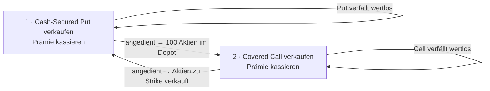

<!-- Kompaktblatt · für Druck auf 2 A4-Seiten optimiert (Seite 1: Regeln · Seite 2: Wheel + ITM/OTM/ATM) -->
# Stillhalter-Kompaktblatt

> ⚠️ Bildungsinhalt, **keine Anlageberatung**. Zahlen illustrativ · Faktor **100 pro Kontrakt** immer mitdenken.

## Die 10 wichtigsten Regeln für Stillhalter

1. **Nur Aktien, die du wirklich besitzen willst.** Ein Cash-Secured Put ist ein Kaufauftrag mit Prämie – nur sinnvoll bei echten Wunsch-Aktien guter Qualität.
2. **Immer gedeckt handeln.** Puts voll mit **Cash** hinterlegen, Calls nur auf **vorhandene 100 Aktien** verkaufen. **Nie „nackt"** als Einsteiger: ein nackter **Call** hat theoretisch **unbegrenztes** Risiko, ein nackter **Put** ein großes, aber **begrenztes** Risiko (Strike × 100, falls Kurs → 0).
3. **Kleine Positionsgrößen.** Pro Trade nur einen kleinen Bruchteil des Depots einsetzen, damit ein Rückschlag verkraftbar bleibt.
4. **Diversifizieren.** Verschiedene Aktien und Branchen – nie alles auf einen Titel.
5. **⭐ Immer Limit-Orders – nie Market-Orders.** Optionen haben **breite Spreads**; eine Market-Order füllt zum schlechtesten Preis. **Limit am Mid** setzen und Richtung Markt **nachtasten** (Verkauf −0,05 $, Kauf +0,05 $). *„Verkaufen: von oben herantasten. Kaufen: von unten."*
6. **30–45 Tage Laufzeit (DTE).** Bester Bereich für den Zeitwertverfall (**Theta arbeitet für dich**).
7. **Strike bei Delta ~0,30** wählen → grob ~30 % Andienungswahrscheinlichkeit; die Option verfällt meist wertlos.
8. **Gewinne früh mitnehmen (~50 %).** Ist die Hälfte der Prämie verdient, zurückkaufen und neu aufsetzen – senkt Risiko und Andienungsstress.
9. **Bevorzugt bei hoher Volatilität verkaufen.** Hohe implizite Volatilität (IV) = höhere Prämien.
10. **Erst Paper Trading, dann echtes Geld.** Alle Abläufe zuerst im Demokonto üben; für Echtzeit-Preise ein **OPRA-Marktdaten-Abo** aktivieren.

> 💡 **Der Merksatz:** Der Stillhalter ist wie eine **Versicherung**, die Prämien kassiert. Meist tritt kein „Schadensfall" ein – dann ist die Prämie verdient. **Disziplin schlägt Cleverness.**

### Ordertyp auf einen Blick

| | **Limit-Order** ✅ | **Market-Order** ❌ |
|---|---|---|
| Regel | „Nur zu meinem Preis oder besser." | „Sofort, egal zu welchem Preis." |
| Garantiert | **Preis** (Ausführung nicht) | **Ausführung** (Preis nicht) |
| Bei Optionen | **immer nutzen** | vermeiden (breiter Spread!) |

**Bid** = sofort verkaufen · **Ask** = sofort kaufen · **Mid** = Mitte (hier Limit ansetzen). Beispiel: Bid 1,20 $ / Ask 1,60 $ → Market-Verkauf bringt **120 $**, Limit @ Mid **140 $** → **+20 $/Kontrakt** nur durch den Ordertyp.

## The Wheel („das Rad") als Schaubild

**Kreislauf:** Puts auf eine Wunschaktie verkaufen, bis du angedient wirst → auf diese Aktien Calls verkaufen, bis sie wieder verkauft werden → von vorn. **In jeder Runde kassierst du Prämie** („zweite Dividende").

| Beispiel-Runde (Aktie X, Kurs 50 $) | Betrag |
|---|---|
| Put verkaufen (Strike 48 $) → Prämie | +100 $ |
| Andienung: 100 Aktien zu 48 $ (Einstand 47 $) | – |
| Covered Call verkaufen (Strike 50 $) → Prämie | +120 $ |
| Aktien zu 50 $ verkauft → Kursgewinn (48→50) × 100 | +200 $ |
| **Summe pro voller Runde** | **+420 $** |

> 🧠 *„Put dich rein, Call dich raus."* · Kennzahlen: **30–45 DTE · Delta ~0,30 · ~50 % Gewinnmitnahme**.
> **Risiken:** fallende Aktie kann das Rad zum Stocken bringen · Gewinn nach oben gedeckelt · Kapital gebunden.

## ITM · ATM · OTM – Tabelle mit Erklärungen

Vergleich von **aktuellem Kurs** und **Strike** (Ausübungspreis). Eine Option ist „im Geld", wenn sich das Ausüben **jetzt schon lohnen** würde.

| Kürzel | Deutsch / Englisch | **Call** (Recht zu **kaufen**) | **Put** (Recht zu **verkaufen**) | Preis / innerer Wert |
|--------|--------------------|--------------------------------|----------------------------------|----------------------|
| **ITM** | im Geld / *In The Money* | Kurs **über** Strike | Kurs **unter** Strike | **teuer** – hat inneren Wert + Zeitwert |
| **ATM** | am Geld / *At The Money* | Kurs ≈ Strike | Kurs ≈ Strike | **höchster Zeitwert**, „auf der Kippe" |
| **OTM** | aus dem Geld / *Out of The Money* | Kurs **unter** Strike | Kurs **über** Strike | **billig** – nur Zeitwert (reine Hoffnung) |

**Beispiele** (Aktienkurs jeweils 100 $):

| Typ | Strike | Status | Erklärung |
|-----|--------|--------|-----------|
| Call | 90 $ | **ITM** | für 90 kaufen dürfen, 100 wert → **10 $ innerer Wert** |
| Call | 110 $ | **OTM** | für 110 kaufen wäre teurer als der Markt (100) |
| Put | 110 $ | **ITM** | für 110 verkaufen dürfen, nur 100 wert → **10 $ innerer Wert** |
| Put | 90 $ | **OTM** | für 90 verkaufen wäre schlechter als der Markt (100) |

> 🧠 **Eselsbrücken:** *„ITM = Intrinsischer (innerer) Wert ist da."* · Test: *„Würde ich mein Recht jetzt sofort nutzen und Geld machen? → ITM, sonst OTM."* · Bild: *ITM = Ware im Korb · OTM = Lottoschein · ATM = Münzwurf.*
>
> **Delta ≈ Wahrscheinlichkeit, im Geld zu enden:** tief OTM ~0,10 · **~0,30 (Stillhalter-Favorit)** · ATM ~0,50 · tief ITM ~0,80–0,90. Eine **OTM-Option verfällt meist wertlos** – genau das will der Stillhalter.
