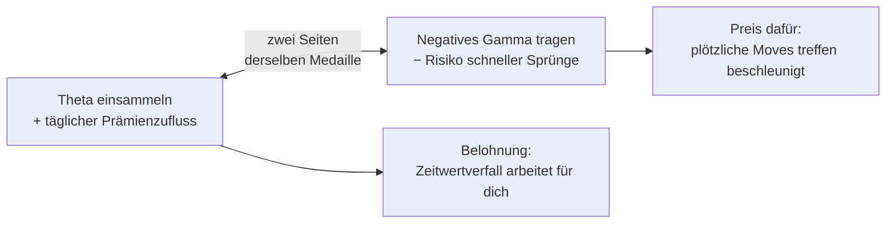
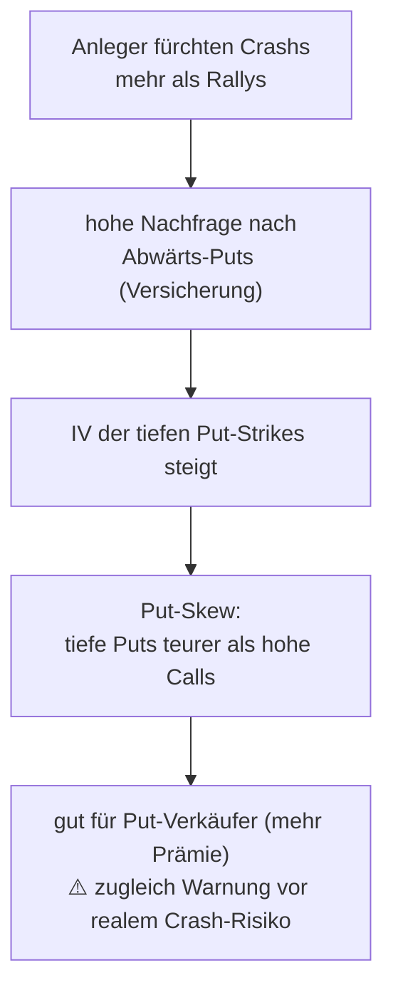
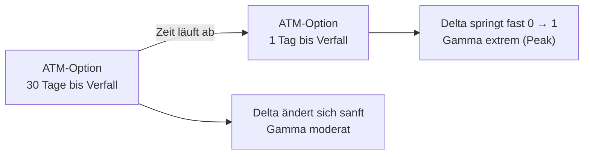
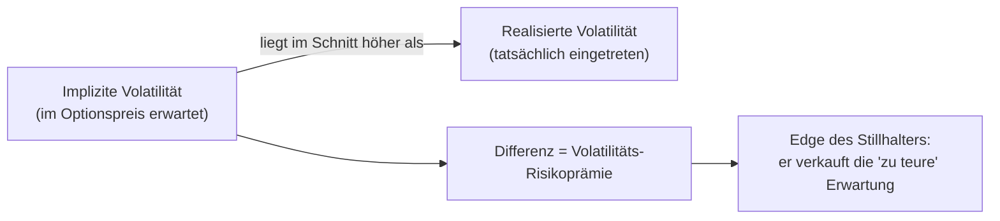

# Vertiefung: Die Griechen & Volatilität für Stillhalter

> Aufbauend auf [Optionshandel_Interactive_Brokers.md](Optionshandel_Interactive_Brokers.md) und [Vertiefung_Optionshandel.md](Vertiefung_Optionshandel.md).
> Diese Vertiefung erklärt die **Griechen** im Detail, das **Gamma-Risiko kurz vor Verfall** und warum
> **implizite vs. historische Volatilität** dem Optionsverkäufer einen systematischen Vorteil verschafft.

> ⚠️ **Hinweis:** Bildungsinhalte, **keine Anlageberatung**. Zahlen sind illustrativ.
> Faktor **100 pro Kontrakt** immer mitdenken.

---

## 1 · Die Griechen im Detail

Die **Griechen** (*Greeks*) messen, wie empfindlich der Optionspreis auf einzelne Einflussgrößen reagiert. Jeder Grieche beantwortet die Frage: *„Wenn sich X um eine Einheit ändert, wie stark ändert sich die Prämie?"*

| Grieche | Misst die Reaktion auf … | Merkhilfe | Typischer Bereich |
|---------|--------------------------|-----------|-------------------|
| **Delta** (Δ) | +1 $ Kursbewegung des Basiswerts | „Richtung / Tempo" | Call 0…+1, Put −1…0 |
| **Gamma** (Γ) | +1 $ Kursbewegung → Änderung von **Delta** | „Beschleunigung" | 0…~0,10 (ATM am höchsten) |
| **Theta** (Θ) | +1 Tag Zeitablauf | „**T**ime" | pro Tag, negativ für Käufer |
| **Vega** (ν) | +1 Prozentpunkt implizite Volatilität | „**V**olatilität" | z. B. 0,05–0,20 pro 1 % IV |
| **Rho** (ρ) | +1 Prozentpunkt Zinsniveau | „**R**ate / Zins" | klein, außer bei langen Laufzeiten |

> 🧠 **Physik-Bild:** *Delta = Geschwindigkeit, Gamma = Beschleunigung.* Delta sagt, wie schnell sich die Prämie bewegt; Gamma, wie schnell sich diese Geschwindigkeit selbst ändert.

### Delta (Δ) – Richtung und Wahrscheinlichkeit

- **Misst:** Änderung der Prämie bei **1 $** Kursbewegung.
- **Bereich:** Call **0 bis +1**, Put **−1 bis 0**. Zweitbedeutung: Delta ≈ **Wahrscheinlichkeit**, im Geld zu enden (Delta 0,30 ≈ 30 % Andienungswahrscheinlichkeit – der Stillhalter-Favorit).
- **Zahlenbeispiel:** Ein verkaufter Put hat aus Käufersicht Delta −0,30 → als **Verkäufer** ist deine Position **+0,30**. Steigt die Aktie um 1 $, gewinnst du ca. **0,30 $ × 100 = 30 $**; fällt sie um 1 $, verlierst du ~30 $.

### Gamma (Γ) – die Beschleunigung des Delta

- **Misst:** Änderung von **Delta** bei 1 $ Kursbewegung (zweite Ableitung).
- **Vorzeichen:** **Long-Optionen immer +Gamma, Short-Optionen immer −Gamma** – unabhängig von Call/Put.
- **Am größten:** **am Geld (ATM)** und **kurz vor Verfall** (siehe Teil 2).
- **Zahlenbeispiel:** Delta 0,40, Gamma 0,10. Steigt die Aktie um 1 $ → Delta 0,50; nochmal 1 $ → Delta 0,60.

> ⚠️ **Für den Stillhalter ist Gamma der Feind:** Negatives Gamma bedeutet, dass das Delta sich **gegen dich** bewegt – bei einer Rally wird dein Short Call immer negativer, bei einem Absturz dein Short Put immer positiver. Verluste **beschleunigen** sich (*Gamma-Risiko*).

### Theta (Θ) – der Zeitwertverfall

- **Misst:** täglichen Prämienverlust allein durch Zeitablauf.
- **Vorzeichen:** **Long negativ** (Käufer verliert täglich), **Short positiv** (Verkäufer verdient täglich).
- **Zahlenbeispiel:** Theta −0,05 → die Option verliert **5 $ pro Tag** (× 100). Als Verkäufer fließen dir **+5 $/Tag** zu, wenn sonst nichts passiert.
- Beschleunigt sich in den **letzten ~30 Tagen** vor Verfall stark (nicht-linear).

> 📌 **Theta ist der beste Freund des Stillhalters.** Deshalb verkaufen konservative Stillhalter mit **30–45 Tagen Restlaufzeit** und nehmen Gewinne oft bei ~50 % mit.

### Vega (ν) – die Volatilitäts-Empfindlichkeit

- **Misst:** Reaktion der Prämie auf **+1 Prozentpunkt** implizite Volatilität (IV).
- **Vorzeichen:** **Long positiv** (profitiert von steigender IV), **Short negativ** (profitiert von **fallender** IV).
- **Zahlenbeispiel:** Vega 0,10 → steigt die IV von 30 % auf 31 %, wird die Option **0,10 $ × 100 = 10 $** teurer. Für den Stillhalter ein Verlust; fällt die IV, ein Gewinn.
- Am größten bei **langen Laufzeiten** und **ATM**.

### Rho (ρ) – der Zins-Einfluss

- **Misst:** Reaktion auf **+1 Prozentpunkt** Zinsniveau.
- **Vorzeichen:** Long **Call +Rho**, Long **Put −Rho**.
- **Praxis:** Für kurzlaufende Stillhalter-Optionen (30–45 Tage) **klein und meist vernachlässigbar**; relevant erst bei sehr langen Laufzeiten (LEAPS).

### Griechen-Profil eines typischen Stillhalters

| Grieche | **Short Put** (CSP) | **Short Call** (Covered Call) | Freund oder Feind? |
|---------|:-------------------:|:-----------------------------:|--------------------|
| **Delta** | **+** (will Aufwärts/Seitwärts) | **−** (will Abwärts/Seitwärts) | neutral (Richtungswette) |
| **Gamma** | **−** | **−** | **Feind** |
| **Theta** | **+** | **+** | **Freund** |
| **Vega** | **−** | **−** | **Freund** bei fallender IV · **Feind** bei steigender IV |
| **Rho** | + (klein) | − (klein) | fast egal |

> 🧠 **Merksatz für den Stillhalter:** *„Ich bin positiv Theta, negativ Gamma, negativ Vega."* – Ich verdiene an der **Zeit**, leide unter **schnellen Bewegungen** und profitiere von **fallender** Angst am Markt.

### Wechselwirkungen zwischen den Griechen

**1) Der zentrale Gamma-Theta-Trade-off** – die wichtigste Beziehung für Stillhalter: **Wer Theta einsammelt, trägt zwingend negatives Gamma.**

- Als Optionsverkäufer kassierst du **täglich Theta** (+) – die Belohnung.
- Der Preis dafür ist **negatives Gamma** (−) – eine plötzliche große Bewegung trifft dich beschleunigt.

> 💡 **Bild:** *Theta ist die Miete, die dir der Optionskäufer Tag für Tag zahlt. Gamma ist die Kaution, die du verlierst, wenn das Haus (der Kurs) plötzlich abbrennt.* Es gibt **kein kostenloses Theta** – die Zeitprämie ist genau die Kompensation für das übernommene Gamma-Risiko.

**2) Delta-Gamma-Beziehung** – Gamma ist die **Änderungsrate von Delta**. Tief ITM (Delta → ±1) und tief OTM (Delta → 0): **Gamma klein**, Delta stabil. ATM (Delta ≈ ±0,5): **Gamma groß**, Delta „wackelt" am stärksten.

**3) Vega-Theta-Zusammenhang** – beide betreffen den **Zeitwert**, aber gegenläufig über die Laufzeit:

| Restlaufzeit | **Vega** | **Theta (pro Tag)** |
|--------------|:--------:|:-------------------:|
| lang (z. B. 180 Tage) | **hoch** | niedrig |
| kurz (z. B. 5 Tage) | **niedrig** | **hoch** (bei ATM) |

> ℹ️ Der Stillhalter mit 30–45 Tagen nimmt bewusst eine **Mischung**: ordentliches Theta, moderates Vega, noch beherrschbares Gamma.

---

## 2 · Volatilitäts-Smile/-Skew und Gamma kurz vor Verfall

### Der Volatilitäts-Smile / -Skew

In der reinen Theorie hätten alle Strikes desselben Verfalls **dieselbe** IV. In der Realität ergibt eine Auftragung der IV gegen die Strikes **keine flache Linie**, sondern eine gekrümmte Kurve.

- **Volatilitäts-Smile:** IV an beiden Enden (tief OTM und tief ITM) höher als ATM → „Lächeln".
- **Volatilitäts-Skew / „Put-Skew":** Bei **Aktien und Indizes** ist die Kurve **schief** – Puts mit tiefen Strikes haben eine **deutlich höhere IV** als Calls mit hohen Strikes.

> 📌 **Für den Stillhalter:** Der Put-Skew macht deine verkauften Puts **teurer** (gut), signalisiert aber auch reales Crash-Risiko. Verkaufe OTM-Puts (Delta ~0,30) nur auf Wunsch-Aktien und in vernünftiger Größe.

### Vega über die Restlaufzeit

**Vega schrumpft, je näher der Verfall rückt** – kurz vor Verfall ist der IV-Einfluss gering.

**Zahlenbeispiel:** Steigt die IV von 30 % auf 35 % (+5 Punkte):
- Eine **180-Tage-Option** (Vega 0,20) gewinnt ~**5 × 0,20 × 100 = 100 $**.
- Eine **7-Tage-Option** (Vega 0,03 – kurze Laufzeit, daher unter dem typischen Bereich) gewinnt nur ~**5 × 0,03 × 100 = 15 $**.

### Gamma-Sensitivität bei kurzer Restlaufzeit – der „Gamma-Peak"

Der Kern des Themas: **Gamma einer ATM-Option steigt kurz vor Verfall dramatisch an.** Warum? Kurz vor Verfall gibt es kaum noch Zeitwert – der Optionswert hängt fast nur an der Frage **ITM oder OTM?** Das Delta muss daher in einem winzigen Kursfenster von nahezu **0 auf nahezu 1** umspringen. Dieses schnelle Umschlagen **ist** hohes Gamma.

**Konkretes Zahlenbeispiel:** Aktie 100 $, verkaufter Put Strike 100 $.
- **30 Tage vor Verfall:** Kurs fällt 100 → 98 $ → Delta wandert sanft ~0,50 → ~0,60. Beherrschbar.
- **Am Verfallstag (0DTE):** Kurs pendelt 99–101 $ → Delta springt von ~0,05 (fast wertlos) auf ~0,95 (fast sicher angedient) und zurück. Ein **2-$-Wackler** entscheidet über **volle Andienung oder wertlosen Verfall**.

> ⚠️ **Zusammenhang mit Theta:** Genau dort, wo Theta am schnellsten läuft (die letzten Tage), ist auch Gamma am höchsten – der **Gamma-Theta-Trade-off in Reinform**.

> 📌 **Bedeutung für 0DTE und Andienungsrisiko:**
> - **0DTE-Optionen** sind praktisch reine Gamma-Wetten – für konservative Stillhalter **ungeeignet**.
> - **Pin-Risiko:** Steht der Kurs am Verfallstag knapp am Strike, kann ein kleiner Nachbörsen-Move über die Andienung entscheiden.
> - **Konsequenz:** Positionen **rechtzeitig schließen oder rollen** (oft bei ~50 % Gewinn), statt sie in die Gamma-Zone am Verfallstag laufen zu lassen.

---

## 3 · Implizite vs. historische Volatilität – der Edge des Verkäufers

### Definitionen und Unterschied

| | **Implizite Volatilität (IV)** | **Historische / Realisierte Volatilität (HV / RV)** |
|---|---|---|
| Blickrichtung | **vorwärts** – erwartete künftige Schwankung | **rückwärts** – gemessene vergangene Schwankung |
| Herkunft | aus dem **Optionspreis** rückgerechnet | aus **realen Kursbewegungen** berechnet |
| Beobachtbar? | nicht direkt – im Preis „versteckt" | direkt aus Kursdaten |
| Aussage | „Was der Markt an Bewegung **erwartet**" | „Was wirklich **passiert ist**" |

> 🧠 **Merksatz:** *IV = Wettervorhersage (erwarteter Sturm). HV = Blick aus dem Fenster auf das Wetter der letzten Wochen.*

### Die Volatilitäts-Risikoprämie (*Variance Risk Premium*)

Der statistische Kern, warum Optionsverkauf systematisch funktioniert: **Die implizite Volatilität liegt im Schnitt HÖHER als die später tatsächlich realisierte Volatilität.** Der Markt „überschätzt" im Mittel die kommende Bewegung. Wer Optionen **verkauft**, verkauft diese systematisch etwas zu teure „Bewegungserwartung" und kassiert die Differenz – die **Volatilitäts-Risikoprämie**.

**Warum ist das so?** Optionskäufer nutzen Optionen wie eine **Versicherung** gegen Kursstürze und zahlen dafür einen **Aufschlag** – so wie man für eine Feuerversicherung mehr zahlt als den statistischen Erwartungswert des Schadens. Der Stillhalter ist die **Versicherung** und vereinnahmt diese Prämie.

### IV-Rank und IV-Percentile

Ein IV-Wert von „30 %" ist für sich wertlos – zwei Kennzahlen setzen ihn ins Verhältnis zur eigenen Historie (meist 52 Wochen):

| Kennzahl | Bedeutung | Beispiel |
|----------|-----------|----------|
| **IV-Rank** | $\dfrac{\text{IV}_{\text{heute}} - \text{IV}_{\text{Tief}}}{\text{IV}_{\text{Hoch}} - \text{IV}_{\text{Tief}}} \times 100$ | IV 30 %, 52W-Range 15–45 % → Rank = $\frac{30-15}{45-15}\times100=50$ |
| **IV-Percentile** | % der Tage, an denen die IV **niedriger** war als heute | IV-Perc. 80 → höher als an 80 % der Tage |

> 💡 **Regel für Stillhalter:** **Hohe IV = teure Optionen = gute Verkaufsgelegenheit.** Bevorzugt bei **hohem IV-Rank** (Faustregel > 50) verkaufen – dann ist die Prämie üppig und die Chance auf eine IV-Rückkehr zum Mittelwert (*mean reversion*, senkt die Optionspreise → gut für den Short) hoch.

### Zahlenbeispiel (IV 30 % erwartet, 20 % realisiert)

Aktie 100 $, IV **30 %** p. a., Laufzeit **1 Monat**.

- **Erwartete (implizite) Monatsbewegung (1 Standardabweichung):** $100\ \$ \times 30\% \div \sqrt{12} \approx \mathbf{8{,}66\ \$}$
- Der Verkäufer kassiert eine auf diese **±8,66 $** kalibrierte Prämie.
- **Realisiert werden aber nur 20 %:** $100\ \$ \times 20\% \div \sqrt{12} \approx \mathbf{5{,}77\ \$}$

> 📌 **Ergebnis:** Der Markt hat für eine **8,66-$-Bewegung** bezahlt, real kamen nur **5,77 $**. Die Differenz ist der **Edge des Stillhalters** – exakt die Volatilitäts-Risikoprämie.

### Grenzen und Risiken

Der Edge ist **statistisch**, keine Garantie:

1. **Tail-Risk / negative Konvexität:** Viele kleine Gewinne, unterbrochen von **seltenen, sehr großen Verlusten**. In Krisen kann die Varianz ein Vielfaches des Normalniveaus erreichen – ein Crash kann die Prämien vieler ruhiger Monate auslöschen.
2. **„Picking up pennies in front of a steamroller":** *Pfennige vor einer Dampfwalze aufsammeln.* Die kleinen Prämien sind die Pfennige, der plötzliche Crash die Dampfwalze.

> ⚠️ **Konsequenz:** Der Edge ist real, aber nur **überlebbar mit Disziplin** – kleine Positionsgrößen, Diversifikation, nur gedeckte Strategien (CSP/CC), keine nackten Calls, Gewinne früh mitnehmen.

---

## Auf einen Blick

| Erkenntnis | Konsequenz für den Stillhalter |
|------------|-------------------------------|
| Stillhalter-Profil = **+Theta, −Gamma, −Vega** | an der Zeit verdienen, schnelle Moves und steigende IV fürchten |
| **Gamma-Theta-Trade-off** | kein kostenloses Theta – Zeitprämie ist die Bezahlung fürs Gamma-Risiko |
| **Gamma-Peak** am Verfallstag | rechtzeitig schließen/rollen (~50 % Gewinn), 0DTE meiden |
| **Put-Skew** | verkaufte Puts sind teurer (gut), aber Crash-Warnung ernst nehmen |
| **IV > RV** (Volatilitäts-Risikoprämie) | der statistische Edge – bei **hohem IV-Rank** verkaufen |
| **Tail-Risk** | Disziplin & Risikomanagement sind Pflicht, nicht Kür |

## Quellen

- **Variance Risk Premium:** <https://en.wikipedia.org/wiki/Variance_risk_premium> · Primärquelle: Carr, P. & Wu, L. (2009), „Variance Risk Premiums", *The Review of Financial Studies* 22(3):1311.
- **Gamma / Greeks:** Investopedia – *Gamma*, *Option Greeks* (Long +Gamma / Short −Gamma; Gamma-Peak nahe Verfall; Delta = Geschwindigkeit, Gamma = Beschleunigung).
- **IV vs. HV, Vega-Laufzeit, Skew:** Investopedia – *How Implied Volatility (IV) Works* und *Implied Volatility: Buy Low and Sell High*.
- **Interne Referenzen:** [Optionshandel_Interactive_Brokers.md](Optionshandel_Interactive_Brokers.md), [Vertiefung_Optionshandel.md](Vertiefung_Optionshandel.md).
