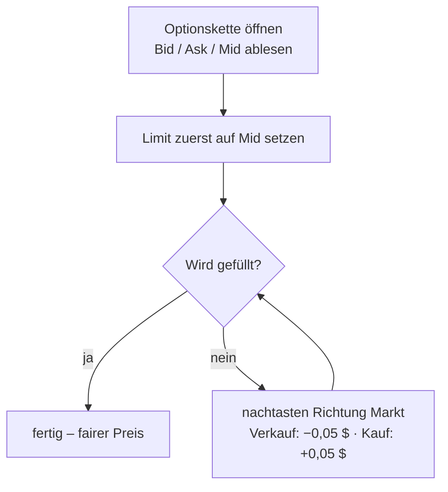
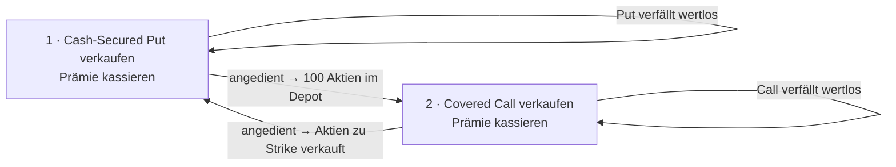
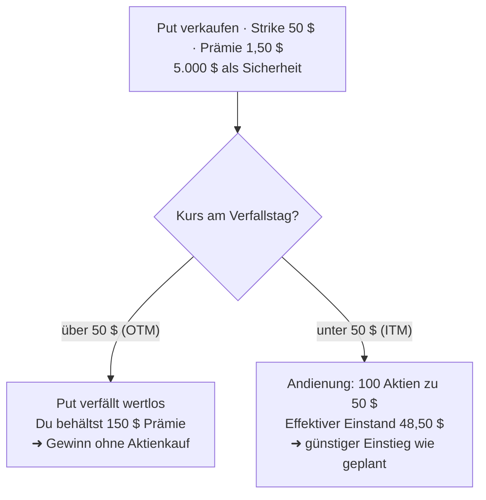
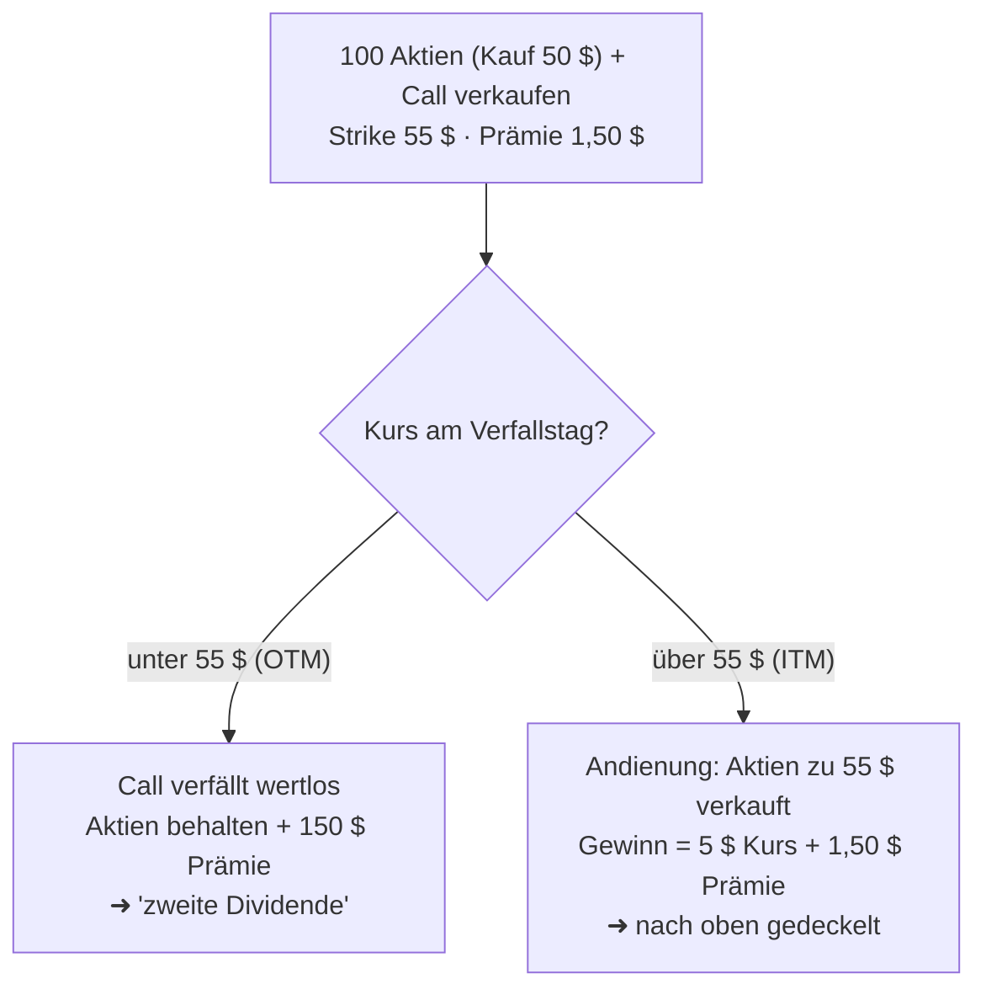

# Vertiefung: Fünf Kernthemen des Optionshandels

> Aufbauend auf [Optionshandel_Interactive_Brokers.md](Optionshandel_Interactive_Brokers.md).
> Diese Vertiefung fasst fünf zentrale Themen für konservative Stillhalter zusammen –
> mit Zahlenbeispielen, Eselsbrücken und Schaubildern.

> ⚠️ **Hinweis:** Bildungsinhalte, **keine Anlageberatung**. Zahlen sind illustrativ.
> Konditionen (Gebühren, Marktdaten) immer aktuell bei Interactive Brokers prüfen.

---

## 1 · Limit-Order vs. Market-Order

Beim Handeln von Optionen entscheidet der **Ordertyp** oft über bares Geld. Es gibt zwei Grundtypen:

| Ordertyp | Was er sagt | Was garantiert ist |
|----------|-------------|--------------------|
| **Market-Order** (Bestens-Order, *Market Order*) | „Führe **sofort** aus, egal zu welchem Preis." | Ausführung ja, **Preis nein** |
| **Limit-Order** (*Limit Order*) | „Führe nur zu **meinem Preis oder besser** aus." | Preis ja, **Ausführung nein** |

> 🧠 **Merksatz:** *Market = „Egal was es kostet, aber jetzt." · Limit = „Nur zu meinem Preis, sonst warte ich."*

### Bid, Ask und Mid

- **Bid** (Geldkurs) = Preis, zu dem du **sofort verkaufen** kannst.
- **Ask / Offer** (Briefkurs) = Preis, zu dem du **sofort kaufen** kannst.
- **Mid** (Mittelkurs) = die Mitte: $\text{Mid} = \dfrac{\text{Bid} + \text{Ask}}{2}$.
- **Spread** (Geld-Brief-Spanne) = Ask − Bid = die „unsichtbare Gebühr" bei sofortiger Ausführung.

> 💡 **Bild:** Der Spread ist wie der Unterschied zwischen An- und Verkaufskurs beim Geldwechsel am Flughafen. Wer es eilig hat (Market), zahlt die volle Spanne; wer geduldig ist (Limit), trifft sich in der Mitte.

### Warum bei Optionen IMMER Limit?

Aktien großer Firmen haben oft nur einen **Cent-Spread**. Optionen sind viel weniger liquide – jede Kombination aus Strike und Verfall ist ein eigener, dünn gehandelter Markt. Die **Spreads sind breit**, und eine Market-Order „springt" über den ganzen Spread zum schlechtesten Preis.

**Zahlenbeispiel – 1 Put verkaufen**, Kette zeigt Bid 1,20 $ / Ask 1,60 $ (Mid 1,40 $):

| Ordertyp | Ausführung | Erlös (× 100) |
|----------|-----------|---------------|
| **Market** | 1,20 $ (schlechter Bid) | **120 $** |
| **Limit @ Mid** | 1,40 $ | **140 $** |

**Unterschied: 20 $ pro Kontrakt** – nur wegen des Ordertyps. Bei 10 Kontrakten sind das 200 $, über viele Trades pro Jahr frisst das den ganzen Prämienvorteil auf. Beim **Kaufen** dreht sich der Nachteil um (Market füllt am hohen Ask).

### So setzt du dein Limit richtig

1. **Am Mid starten** – wird sehr oft direkt gefüllt.
2. **Nachtasten:** beim **Verkauf** in 0,05-$-Schritten nach unten, beim **Kauf** nach oben – immer Richtung Markt, nie sofort drüber.
3. Nur **liquide Optionen** handeln (enge Spreads, hohes Open Interest).

> 🧠 **Merksatz zum Nachtasten:** *„Verkaufen: von oben herantasten. Kaufen: von unten herantasten."*

**Zur Abgrenzung:** Eine **Stop-Order** wird bei einem Auslösekurs zur Market-Order (bei Optionen wegen der breiten Spreads riskant); eine **Stop-Limit-Order** wird zur Limit-Order (sicherer beim Preis, kann aber unausgeführt bleiben). Für konservative Stillhalter gilt: **Öffnen und Schließen grundsätzlich mit Limit-Orders.**

---

## 2 · The Wheel („das Rad")

„The Wheel" verbindet die zwei Einsteiger-Strategien zu einem **endlosen Kreislauf**, der in jeder Runde Prämie abwirft: Erst **Cash-Secured Puts** auf eine Wunschaktie verkaufen, bis man sie angedient bekommt; dann auf diese Aktien **Covered Calls** verkaufen, bis sie wieder verkauft werden – und von vorn.

### Durchgängiges Zahlenbeispiel

Wunschaktie **X**, Kurs 50 $, du hast 5.000 $ bereit.

1. **Put verkaufen** (Strike 48 $, 30–45 Tage): **+100 $** Prämie.
2. Kurs fällt unter 48 $ → **Andienung:** 100 Aktien zu 48 $. Prämie senkt den Einstand auf **47 $**.
3. **Covered Call verkaufen** (Strike 50 $): **+120 $** Prämie.
4. Kurs steigt über 50 $ → Aktien werden zu 50 $ verkauft → zurück zu Schritt 1.

| Baustein einer vollen Runde | Betrag |
|-----------------------------|--------|
| Put-Prämie | +100 $ |
| Call-Prämie | +120 $ |
| Kursgewinn (48 $ → 50 $) × 100 | +200 $ |
| **Summe** | **+420 $** |

> ℹ️ Der Kursgewinn wird vom **echten Kaufpreis 48 $** gerechnet (nicht vom Einstand 47 $), weil die Put-Prämie (+100 $) oben bereits **separat** zählt – sonst würde sie doppelt gutgeschrieben.

> 🧠 **Merksatz:** *„Put dich rein, Call dich raus."* – unten mit Puts einsammeln, oben mit Calls abgeben.

**Vorteile:** doppelte Einnahmequelle (Prämie + Kursgewinn), günstiger Einstieg, klarer wiederholbarer Prozess, Theta arbeitet durchgehend für dich.

**Risiken (ehrlich):**
- **Fallende Aktie:** Stürzt X nach der Andienung tief ab, sitzt du auf Buchverlusten und willst nicht unter deinem Einstand verkaufen → das Rad kann **stocken**.
- **Gedeckelter Gewinn:** Rennt X über den Call-Strike, verpasst du die Rally.
- **Kapitalbindung** und **kein Ersatz für Diversifikation**.

**Typische Kennzahlen:** 30–45 Tage Laufzeit (*DTE*), Strike bei **Delta ~0,30** (≈ 30 % Andienungswahrscheinlichkeit), Gewinnmitnahme oft bei **~50 %** der Prämie.

---

## 3 · Das OPRA-Paket

**OPRA = Options Price Reporting Authority.** Sie betreibt den **konsolidierten Echtzeit-Datenfeed** für **US-Optionspreise**: OPRA sammelt Kurse und Trades von **allen** SEC-zugelassenen US-Optionsbörsen (Cboe, Nasdaq/PHLX/ISE, NYSE, MIAX, BOX, MEMX u. a. – zusammen ~18 Märkte), bündelt sie zu **einem** offiziellen Datenstrom und verteilt ihn an Broker wie IBKR. Rechtlich ist OPRA ein von der SEC beaufsichtigter **National-Market-System-Plan**.

> 💡 **Bild:** OPRA ist die **zentrale Kurstafel für alle US-Optionen** – statt jede Börse einzeln zu fragen, bekommst du einen offiziellen Gesamtüberblick über den besten Bid und Ask.

### Warum du bei IBKR ein OPRA-Abo brauchst

IBKR liefert **verzögerte** Optionsdaten kostenlos, aber für **Echtzeit-Optionspreise** ist das **kostenpflichtige OPRA-Abo** nötig.

| | Verzögert (*delayed*) | Echtzeit (OPRA) |
|---|---|---|
| Zeitverzug | ~15 Minuten | live |
| Kosten bei IBKR | kostenlos | kostenpflichtiges Abo |
| Für Optionen geeignet? | nur grob schauen | **ja** – nötig fürs Limit-Setzen |

> ⚠️ Mit 15 Minuten alten Kursen setzt du dein Limit auf einen **veralteten Mid** – bei breiten Spreads ein teurer Fehler. Fürs echte Handeln sind **Echtzeit-OPRA-Daten praktisch Pflicht**.

**Kosten (grobe Ordnung):** Für **Privatanleger (Non-Professional)** günstig – Größenordnung **~1,50 USD/Monat**; für **Professional** deutlich teurer (~100 USD+). Wer privat qualifiziert, muss das bei IBKR bestätigen. Abos werden **nicht anteilig** berechnet. **Exakte Beträge live auf der IBKR-Seite „Market Data Pricing" prüfen.**

---

## 4 · ITM, ATM und OTM

Die drei Begriffe beschreiben das Verhältnis von **aktuellem Kurs** zum **Strike**:

| Kürzel | Deutsch / Englisch | **Call** (Recht zu kaufen) | **Put** (Recht zu verkaufen) |
|--------|--------------------|-----------------------------|-------------------------------|
| **ITM** | im Geld / *In The Money* | Kurs **über** Strike | Kurs **unter** Strike |
| **ATM** | am Geld / *At The Money* | Kurs ≈ Strike | Kurs ≈ Strike |
| **OTM** | aus dem Geld / *Out of The Money* | Kurs **unter** Strike | Kurs **über** Strike |

**Logik (immer aus Käufersicht):** Eine Option ist „im Geld", wenn es sich **jetzt schon lohnen** würde, sie auszuüben – Call lohnt bei Kurs **über** Strike, Put bei Kurs **unter** Strike.

### Vier Beispiele

| Typ | Kurs | Strike | Status | Warum |
|-----|------|--------|--------|-------|
| **Call** | 100 $ | 90 $ | **ITM** | für 90 kaufen, 100 wert → 10 $ innerer Wert |
| **Call** | 100 $ | 110 $ | **OTM** | für 110 kaufen wäre teurer als der Markt |
| **Put** | 100 $ | 110 $ | **ITM** | für 110 verkaufen dürfen, nur 100 wert → 10 $ innerer Wert |
| **Put** | 100 $ | 90 $ | **OTM** | für 90 verkaufen wäre schlechter als der Markt |

### Eselsbrücken

- **„ITM = Intrinsischer (Innerer) Wert ist da."** Nur ITM-Optionen haben inneren Wert.
- **Test:** *„Würde ich mein Recht jetzt sofort nutzen und Geld machen? → ITM. Sonst → OTM."*
- **ATM = „auf der Kippe"** – Kurs genau am Strike.
- **Bild:** *ITM = Ware im Korb (hat Substanz) · OTM = Lottoschein (nur Chance) · ATM = Münzwurf.*

### Zusammenhang mit Preis und Delta

$$\text{Prämie} = \text{Innerer Wert} + \text{Zeitwert}$$

- **Innerer Wert** = Betrag, um den die Option ITM ist (bei ATM/OTM = 0).
- Eine **OTM-Option besteht zu 100 % aus Zeitwert** → verfällt sie OTM, ist sie **wertlos** (genau das will der Stillhalter).
- **ITM ist teuer** (echtes Geld + Zeitwert), **OTM ist billig** (nur Hoffnung), **ATM hat den höchsten Zeitwert**.
- **Delta** ≈ Wahrscheinlichkeit, im Geld zu enden: tief OTM ~0,10 · **~0,30 (Stillhalter-Favorit)** · ATM ~0,50 · tief ITM ~0,80–0,90.

> 💡 Stillhalter verkaufen gern **OTM-Optionen bei Delta ~0,30**: ordentliche Prämie, aber nur ~30 % Andienungswahrscheinlichkeit – die Option verfällt meist wertlos.

---

## 5 · Covered Call & Cash-Secured Put

Beide sind **gedeckte** Stillhalter-Strategien: Das Risiko ist kalkulierbar, weil du entweder die **Aktien** (Covered Call) oder das **Geld** (Cash-Secured Put) bereithältst.

### Cash-Secured Put (CSP)

**Idee:** Put auf eine Aktie verkaufen, die du **ohnehin kaufen willst** – nur billiger. Kaufgeld liegt bereit.

Beispiel: Aktie 52 $, Put Strike 50 $, Prämie 1,50 $ (+150 $), 5.000 $ Sicherheit.

| Kennzahl | Formel | Beispiel |
|----------|--------|----------|
| **Max-Gewinn** | Prämie × 100 | 150 $ |
| **Breakeven** | Strike − Prämie | 48,50 $ |
| **Max-Verlust** | (Strike − Prämie) × 100, falls Kurs → 0 | 4.850 $ |

### Covered Call (CC)

**Idee:** Du **besitzt bereits 100 Aktien** und verkaufst darauf einen Call. Prämie kassieren, bereit sein, zum höheren Strike abzugeben.

Beispiel: 100 Aktien (Kauf 50 $), Call Strike 55 $, Prämie 1,50 $ (+150 $).

| Kennzahl | Formel | Beispiel |
|----------|--------|----------|
| **Max-Gewinn** | (Strike − Kaufpreis + Prämie) × 100 | 650 $ |
| **Breakeven** | Kaufpreis − Prämie | 48,50 $ |
| **Hauptnachteil** | Gewinn nach oben **gedeckelt** | über 55 $ verpasst du |

> 💡 Beide Breakevens landen im Beispiel bei **48,50 $** – das unterstreicht die Spiegel-Beziehung zwischen CSP und CC.

### Die Spiegel-Beziehung

| | Cash-Secured Put | Covered Call |
|---|---|---|
| Du hältst bereit | **Geld** | **Aktien** |
| Du verkaufst | **Put** | **Call** |
| Andienung heißt | du **kaufst** Aktien | du **verkaufst** Aktien |
| Ziel | günstig **einsteigen** + Prämie | Prämie + geplant **aussteigen** |

> 🧠 **Merksatz:** *„CSP = bezahlt werden fürs Warten auf einen günstigen Kauf. CC = bezahlt werden fürs Warten auf einen guten Verkauf."* Beide zusammen ergeben **The Wheel**.

---

## Quellen

- **OPRA (offiziell):** <https://www.opraplan.com/>
- **Wikipedia – Options Price Reporting Authority:** <https://en.wikipedia.org/wiki/Options_Price_Reporting_Authority>
- **Interactive Brokers – Market Data Pricing:** <https://www.interactivebrokers.com/en/pricing/research-news-marketdata.php>
- **Referenzdokument (intern):** [Optionshandel_Interactive_Brokers.md](Optionshandel_Interactive_Brokers.md)
